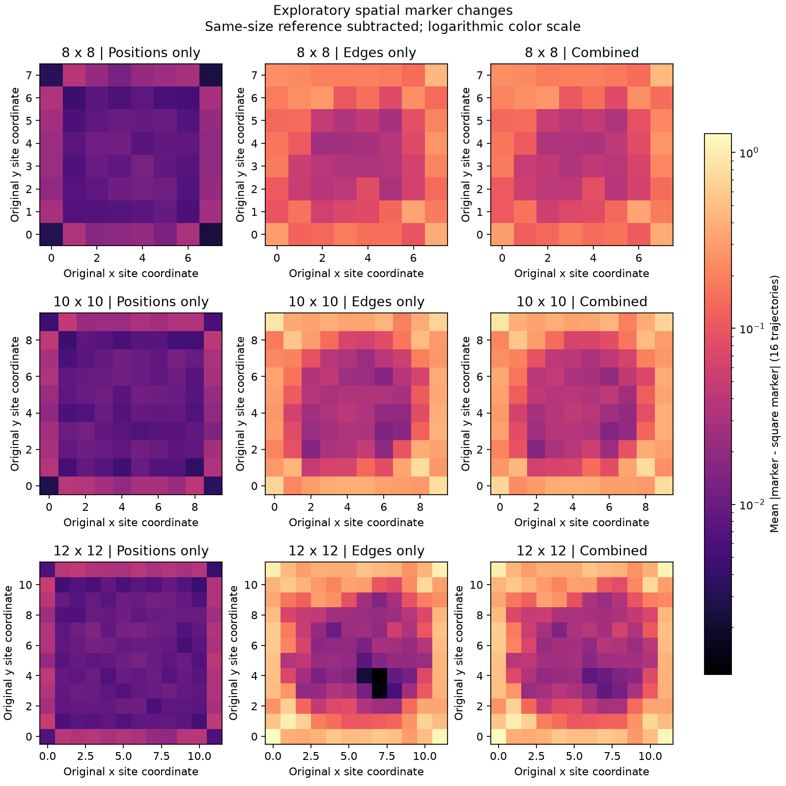

# Räumliche Auswertung des Größen-/Methodenversuchs

Stand: 2026-09-09. Explorative Auswertung nach Kenntnis der Ergebnisse von
`TOPOSC-P10-SIZE-001`. Die ursprünglichen Kriterien und Resultate bleiben gültig.

## Ergebnis und Bedeutung

Kantentausche verändern die lokalen Chern-Marker besonders stark in Randnähe.
Innerhalb derselben Entfernungsschale zum Rand sind Änderungen nahe einer
getauschten Kante außerdem meist größer als weiter entfernt. Messbare Änderungen
reichen auch ins Innere. Die Daten sprechen damit für eine räumlich strukturierte
Reaktion auf die Eingriffe. Sie belegen weder einen topologischen Phasenübergang
noch einen Robustheitsvorteil einer neuen Geometriefamilie.

Bei reinen Positionsverschiebungen bestehen 8/16, 16/16 und 16/16 Varianten die
bisherigen Screening-Kriterien für 8×8, 10×10 und 12×12. Der Median der zentralen
Abweichung `abs(C-1)` beträgt 0.00474938, 0.00102653 und 0.00104529. Die Verbesserung
von 8×8 zu den größeren Systemen setzt sich zwischen 10×10 und 12×12 also nicht
monoton fort. Dort sind außerdem verschiedene Realisierungen untersucht worden.

## Daten und Integrität

Quelle: [versiegelter Hauptlaufbericht](../../../results/phase_10_size_methods_v1/full/report.md),
Code-Revision `9eb86447f655a6e4fa2c12dd6909e478a8d225c5`.
Alle 150 Zellen sind verfügbar, alle sechs Kontrollbewertungen gültig. Die 456
Artefakt-Prüfsummen stimmen. Eingaben, Geometrie-IDs, Zellrollen und gespeicherte
Ergebnisse wurden miteinander abgeglichen. Die ursprüngliche Zusammenfassung
wurde aus den Zellergebnissen reproduziert.

Vor und nach der räumlichen Auswertung wurde das vollständige Hauptlaufinventar
erneut geprüft. SHA-256 von `full/complete.json`:
`b1b2e31cc7063c576c5b31d1edc4d1275deed8fb338cae9cde4ed95b895db8ac`.
Es wurden keine neuen Geometrien, Hamiltonians oder Eigenpaare berechnet.

Die fünf archivierten Maskenauswertungen besitzen pro Geometrie dieselbe lokale
Markerkarte. Die unterschiedlichen Chern-Schätzungen entstehen durch die
jeweilige Auswahl und Flächenmittelung. Diese Mittelungen wurden aus den
Markerfeldern mit einer Abweichung unter `1e-12` reproduziert.

## Definition der zusätzlichen Auswertung

Für jeden ursprünglichen Gitterplatz wird die lokale Markerdichte der passenden
Quadratreferenz abgezogen: `delta_i = marker_variant_i - marker_square_i`.
Die lexikographische Sortierung der gespeicherten Koordinaten wird dazu wieder
in physikalische Knotennummerierung übersetzt. Auch verschobene Knoten bleiben
über ihre ursprüngliche Identität zugeordnet.

Die Randtiefe wird auf dem ursprünglichen Gitter definiert:
`d = min(x, y, n-1-x, n-1-y)`. Tiefe 0 bezeichnet den äußeren Rand, Tiefe 1 die
erste innere Reihe. Innerhalb jeder Schale wird zunächst pro Trajektorie das
arithmetische Mittel von `abs(delta_i)` berechnet; die Tabellen berichten den
Median dieser 16 Trajektorienmittel.

Für die Nähe zu Kanten wird der euklidische Abstand auf den ursprünglichen
Koordinaten zu den endgültig entfernten oder hinzugefügten Kantensegmenten
verwendet. Bereits rückgängig gemachte Schritte zählen nicht als Änderung.
Explorative Definition: nah bei Abstand ≤1, fern bei Abstand >2 Gitterabständen;
die Zwischenzone bleibt aus diesem Vergleich heraus. Nah/fern werden nur innerhalb
derselben Randtiefe und derselben Trajektorie verglichen. Fehlt einer der beiden
Bereiche, entfällt diese Trajektorie allein aus dem betreffenden Nah/Fern-Vergleich.
Bei reinen Positionsänderungen gibt es keine getauschten Kanten.

Diese Abstände wurden nach Einsicht in den Hauptlauf gewählt. Die Vergleiche
sind deskriptiv; sie liefern keine unabhängige Bestätigung und keine neuen Gates.
Mehrere Orte, Schalen, Masken und gepaarte Varianten sind keine unabhängigen
Stichproben. Andere Einflüsse wie Ecknähe, Anzahl und Lage der Kantenänderungen
werden durch die Schichtung nach Randtiefe nicht vollständig kontrolliert.

## Räumliche Größenordnung

Median des mittleren absoluten Markerunterschieds zur gleich großen Referenz:

| Größe | Eingriff | Rand (d=0) | d=2 | Innerste Schale |
| --- | --- | ---: | ---: | ---: |
| 8×8 | Positionen | 0.02045 | 0.01016 | 0.00968 (d=3) |
| 8×8 | Kanten | 0.18925 | 0.03764 | 0.01821 (d=3) |
| 8×8 | kombiniert | 0.19154 | 0.04180 | 0.02214 (d=3) |
| 10×10 | Positionen | 0.02645 | 0.00944 | 0.00811 (d=4) |
| 10×10 | Kanten | 0.35496 | 0.03472 | 0.02824 (d=4) |
| 10×10 | kombiniert | 0.36633 | 0.03705 | 0.03373 (d=4) |
| 12×12 | Positionen | 0.03230 | 0.00926 | 0.00911 (d=5) |
| 12×12 | Kanten | 0.50661 | 0.05096 | 0.00445 (d=5) |
| 12×12 | kombiniert | 0.49840 | 0.05506 | 0.01752 (d=5) |

Das sind lokale Markerunterschiede zur Referenz, keine Fehler des gemittelten
Chern-Index. Deshalb darf man diese Zahlen nicht an dessen Schwelle 0.005 messen.
Lokale positive und negative Änderungen können sich bei der Flächenmittelung
teilweise aufheben. Die innerste Schale umfasst jeweils nur vier Knoten; sie
ersetzt nicht die vorab festgelegte zentrale Maske mit 16, 16 bzw. 36 Knoten.
Ein größeres System garantiert hier keinen monoton kleineren lokalen Unterschied.

Die Grafik mittelt `abs(delta_i)` ortsweise über alle 16 Trajektorien. Alle neun
Felder haben dieselbe logarithmische Farbskala; hell bedeutet eine stärkere
Änderung gegenüber dem Quadrat. Es werden keine besonders auffälligen Kandidaten
ausgewählt. Da die getauschten Kanten zwischen Trajektorien verschieden liegen,
verschmiert ihre genaue Lage in dieser Übersicht.



## Nähe zu geänderten Kanten

Für reine Kantentausche in Randtiefe 2:

| Größe | Trajektorien mit nahen und fernen Orten | Davon nah stärker | Median Nah-minus-Fern |
| --- | ---: | ---: | ---: |
| 8×8 | 14/16 | 14/14 | 0.06864 |
| 10×10 | 16/16 | 16/16 | 0.07229 |
| 12×12 | 16/16 | 16/16 | 0.10860 |

Bei 12×12 zeigen auch in Tiefe 3 alle 16 vergleichbaren Trajektorien stärkere
Änderungen nahe den getauschten Kanten. Das Muster ist somit nicht auf die
äußerste Randreihe beschränkt. Alle Schalen und die kombinierten Varianten sind
mit ihren jeweiligen Nennern in [spatial_summary.json](spatial_summary.json) gespeichert.

## Anteil der geänderten Messregion

Zusätzlich wird die Änderung einer Chern-Schätzung rechnerisch zerlegt:

`C(Variante, neue Maske) - C(Quadrat, alte Maske)`

`= [C(Variante, neue Maske) - C(Quadrat, neue Maske)]`

`  + [C(Quadrat, neue Maske) - C(Quadrat, alte Maske)]`.

Der zweite Term misst allein, was die veränderte Ortsauswahl am unveränderten
Referenzfeld bewirkt. Sein größter Absolutwert über alle Kanten- und kombinierten
Varianten und beide Graphmasken beträgt etwa 0.001715. Für die Graphmaske Tiefe 2
bei reinen Kantentauschen betragen die Mediane des absoluten ersten Terms
0.00988, 0.00820 und 0.01415 für die drei Größen; der Median des absoluten zweiten
Terms ist jeweils null, da bei mehr als der Hälfte die Maske unverändert bleibt.

Das Feld selbst trägt also wesentlich zum Unterschied bei. Diese Zerlegung
isoliert bei verschobenen Orten die Feld- und Flächenänderung nicht voneinander.
Sie bewertet den Auswahleffekt am Quadrat; Wechselwirkungen zwischen Maske und
verändertem Feld liegen im ersten Term. Daher folgt daraus nicht, dass die
Maskenwahl am Kandidaten unwichtig wäre. Dafür sind die fünf ursprünglichen
Maskenergebnisse weiterhin einzeln auszuwerten.

## Folgerung für das Forschungsprogramm

Die bisherigen Resultate liefern eine konkrete Arbeitshypothese: Kantentausche
erzeugen räumlich begrenzte Markeränderungen, deren Sichtbarkeit vom Abstand
zum Eingriff und zum Rand sowie von der Mittelungsregion abhängt. Ihre Beiträge
verschwinden in diesen Systemgrößen nicht allgemein. Dass alle 144 Varianten
Bott- und Localizer-Index +1 liefern, entscheidet die Frage nach der Ursache
der Chern-Abweichungen nicht allein.

Als nächster Versuchsplan bietet sich eine gezielte Untersuchung der Lage der
Eingriffe an: randnahe und innere Kantentausche mit explizit abgestimmten
Ressourcen und Auswertungsregionen. Die Auswahlregeln, Vergleichsgrößen, Seeds
und Kontrollkriterien müssten vor neuen Rechnungen feststehen; die Daten dieser
Auswertung dürfen nicht als unabhängige Bestätigung dieser Hypothese dienen.
Insbesondere ist noch kein Motiv mit unabhängig validiertem Robustheitsvorteil
entdeckt worden. Ein solcher Folgelauf wurde hier weder implementiert noch gestartet.

## Reproduktion und Prüfung

Das [Analyseskript](../../../examples/phase_10_marker_analysis.py) liest die vorhandenen
Archive und schreibt nur in einen neuen Analyseordner. Für eine Wiederholung im
Projektordner (die Originalresultate müssen vorhanden sein):

```powershell
$env:PYTHONDONTWRITEBYTECODE='1'
$env:PYTHONPATH='src'
$env:OMP_NUM_THREADS='1'
$env:OPENBLAS_NUM_THREADS='1'
$env:MKL_NUM_THREADS='1'
$env:BLIS_NUM_THREADS='1'
.\.venv\Scripts\python.exe -B examples\phase_10_marker_analysis.py --output docs\analysis\phase_10_size_methods_spatial_repeat1
```

Der Ausgabeordner darf noch nicht existieren. Das Skript wird ohne `-O` ausgeführt,
damit die eingebauten Audit-Assertions aktiv bleiben. Ein Hash des tatsächlich
ausgeführten Skripts steht zusammen mit dem Quellhash in `spatial_summary.json`.

Prüfung: Ausführung auf allen 150 archivierten Zellen, Reproduktion der ursprünglichen
Zusammenfassung und Chern-Mittelungen, vollständiges pytest (2570 bestanden),
Ruff für das neue Skript und strict mypy mit Python-Ziel 3.14. Projektweites Ruff
meldet weiterhin 145 bekannte Altbefunde. Die Grafik wurde visuell geprüft.
