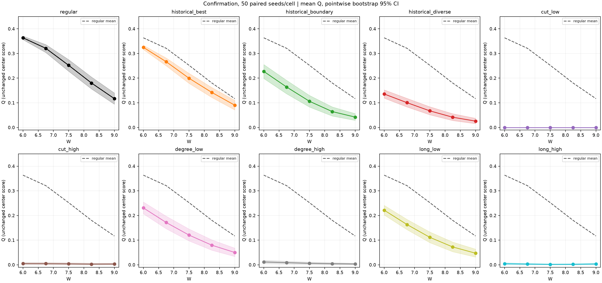
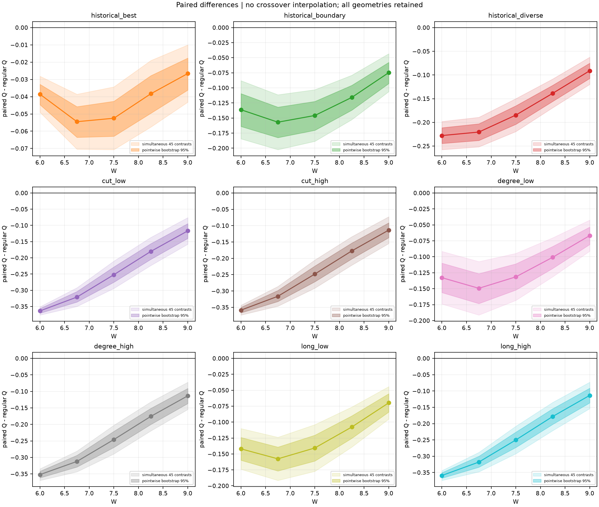
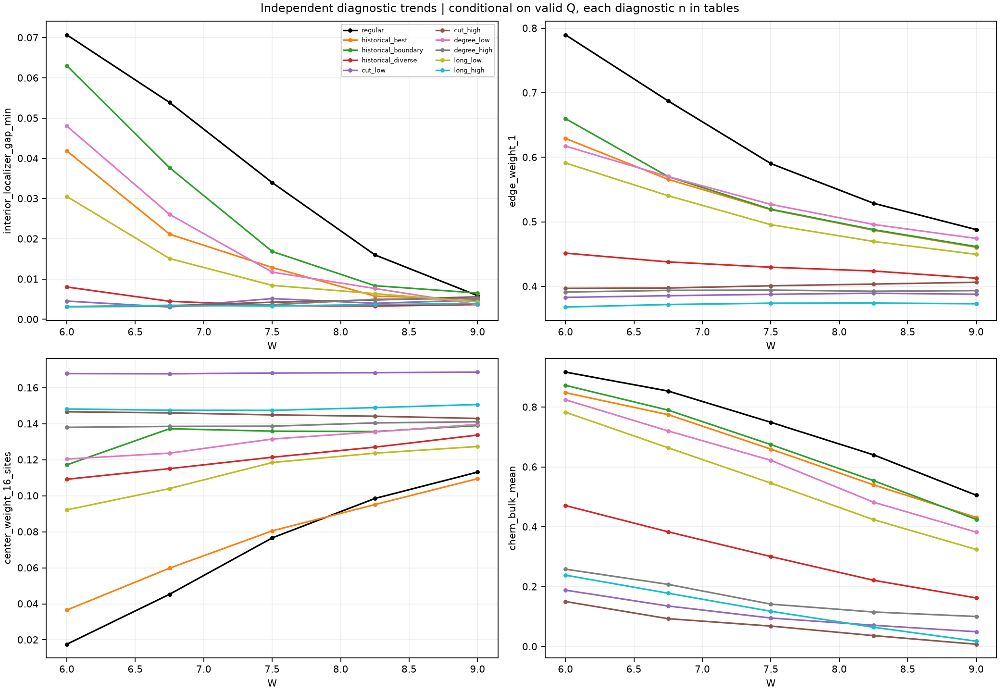

# Phase 18: statistische Bestätigung

Abgeschlossen am 25.09.2026. **Das reguläre Gitter hat bei allen fünf geprüften
Disorder-Stärken W=6 bis 9 einen höheren mittleren Score als jede der neun
Vergleichsgeometrien. Ein Cross-over ist innerhalb dieses Rasters nicht belegt.**
Der zuvor beobachtete Vorteil bei schwacher Unordnung W=1,2 beziehungsweise 3
bleibt unbestätigt, weil diese Werte nicht zum beauftragten Bestätigungsraster gehören.

2.500 neue Unordnungsrealisierungen plus zehn saubere Referenzen wurden vollständig
gerechnet: 2.510 Versuche, keine Wiederholung, kein Ausfall, keine ungültige primäre
Auswertung. Laufzeit einschließlich Abschluss: 4.073 s, etwa 67,9 Minuten.
Pipeline, Geometrien, Score und Auswahl blieben unverändert. Keine Folgestudie gestartet.

## Antworten auf die fünf Forschungsfragen

1. **Ist der Vorteil bei schwacher Unordnung reproduzierbar?** Mit diesem Lauf
   nicht entscheidbar. Bei W=6, dem niedrigsten hier geprüften Wert, ist bereits
   das reguläre Gitter besser. Pilot und historische Suche werden nicht mit den
   neuen Seeds zusammengelegt; aus ihnen entsteht kein zusätzlicher Bestätigungsnachweis.
2. **Gibt es einen Cross-over?** Keinen nachgewiesenen Cross-over zwischen W=6 und 9.
   Alle 45 mittleren gepaarten Unterschiede zur Baseline sind negativ, ihre
   simultanen Intervalle schließen null aus. Das bestätigt die negative Seite
   des früheren Verdachts, aber weder eine positive Seite bei kleinerem W noch
   einen Übergangspunkt außerhalb des Rasters.
3. **Welche Geometrien bleiben über mehrere W robust?** Das reguläre Gitter und
   `historical_best` bestehen bei W=6 und 6,75 häufig; regulär bleibt auch bei
   W=7,5 mit 38/50 Erfolgen stärker. Bei W=9 erreicht regulär nur 8/50,
   `historical_best` 2/50 Erfolge. Keine Geometrie zeigt über das gesamte Raster
   hinweg eine hohe Erfolgsrate. Eine neue Schwelle für „robuste Geometrie“ wurde
   nicht nachträglich eingeführt.
4. **Welche physikalische Größe verursacht den Unterschied?** Eine einzelne
   Ursache lässt sich aus dieser festen, strukturell nicht isolierten Kohorte
   nicht bestimmen. Der Baseline-Vorteil geht mit größerer innerer Localizer-Lücke,
   stärkerer Randlokalisierung und höheren Bulk-Chern-Mitteln einher. Das sind
   begleitende Diagnosen, keine kontrollierte kausale Zerlegung.
5. **Ist der aktuelle Score ungeeignet?** Es gibt keine Hinweise auf einen
   Rechenfehler im Score. Als lokales Zentrumskriterium ist er reproduzierbar;
   als alleiniger Nachweis räumlich ausgedehnter Topologie oder Majorana-Physik
   reicht er nicht. Räumliche und diagnostische Abweichungen sind unten ausgewiesen.

## Vorgehen und statistische Reichweite

Zehn vorab eingefrorene Geometrien mit je 100 Orten und 180 Kanten;
W=6/6,75/7,5/8,25/9; Seeds 181001–181050, sauberer Seed 181000.
Bei gleichem W und Seed liegt für alle Geometrien exakt dasselbe Disorder-Feld vor.
Auch über W hinweg wird derselbe Seed verwendet: Gesamtintervalle beruhen daher
auf **50 unabhängigen Seed-Blöcken**, nicht auf 250 unabhängigen Wiederholungen.
Die zehn sauberen Referenzen sind nicht Teil dieser Stichprobenstatistik.

Unverändert gilt: Q ist die kleinste Zentrumslücke über die drei Localizer-Skalen
0,1/0,2/0,3, sofern die ursprünglichen Index-, Invertibilitäts- und PHS-Bedingungen
erfüllt sind; andernfalls Q=0. Erfolg bedeutet Q≥0,20 bei erfüllten Bedingungen.
Physikalisches Nichtbestehen wird von numerischer Ungültigkeit getrennt.

Alle 50 Zellen enthalten n=50 gültige Werte. Gespeichert sind Mittelwert, Median,
Stichproben-Standardabweichung, Standardfehler, t- und Bootstrap-Mittelwertintervalle,
Quantile 0/5/25/50/75/95/100 Prozent sowie Erfolgsraten mit Wilson-95%-Intervallen.
Bootstrap: 20.000 Ziehungen, fester Auswertungsseed. Die drei vorab festgelegten
historischen Gesamtvergleiche verwenden Bonferroni-98,333%-Bootstrap-Intervalle.

Der zusätzliche [Auswertungsplan](phase18_confirmation_analysis_plan.md) wurde
vor Sichtung neuer Ergebnisse gespeichert. Für den Cross-over gelten simultane
Bonferroni-t-Intervalle über alle 45 Geometrie/W-Vergleiche, Familienniveau 95%:
dieselbe Geometrie muss bei niedrigerem W einen positiven und bei höherem W einen
negativen Unterschied zeigen. Bei n=50 ist die t-Abdeckung approximativ;
punktweise gepaarte Bootstrap-Intervalle dienen ergänzend als Sensitivitätsdarstellung.
Keine Interpolation eines kritischen W, keine nachträgliche Geometrieauswahl.

## a) Robuste Befunde im getesteten Protokoll

Der historische Spitzenkandidat liegt bereits bei W=6 unter der Baseline.
Sein mittlerer Unterschied über das Raster ist −0,04210,
98,333%-Bootstrap-CI [−0,05092; −0,03421]. Die CI-Halbbreite 0,00835 erfüllt
die vorab festgelegte Präzisionsgrenze 0,01.

| Historischer Kontrast gegen regulär, Mittel über fünf W | ΔQ | 98,333%-CI | Halbbreite ≤0,01 |
|---|---:|---:|---|
| historical_best | −0,04210 | [−0,05092; −0,03421] | ja |
| historical_boundary | −0,12590 | [−0,14834; −0,10543] | nein |
| historical_diverse | −0,17253 | [−0,18758; −0,15778] | nein |

Die letzten beiden Richtungen sind klar negativ, ihre Effektgrößen aber weniger
präzise als gewünscht. Es erfolgte keine automatische Stichprobenerweiterung.

Für `historical_best` liegen selbst die über alle 45 Vergleiche korrigierten
ΔQ-Intervalle bei W=6 vollständig zwischen −0,04904 und −0,02814, bei W=9
zwischen −0,04318 und −0,01004. Auch alle übrigen Geometrie/W-Kontraste sind negativ.
Das betrifft den mittleren Q-Wert, nicht die Behauptung, jede einzelne Realisierung
oder jeder binäre Erfolgsvergleich sei signifikant besser.

| Geometrie | W=6 | W=6,75 | W=7,5 | W=8,25 | W=9 |
|---|---:|---:|---:|---:|---:|
| regular | 100% | 96% | 76% | 44% | 16% |
| historical_best | 100% | 92% | 54% | 24% | 4% |
| historical_boundary | 58% | 40% | 20% | 4% | 0% |
| historical_diverse | 16% | 8% | 0% | 0% | 0% |
| cut_low | 0% | 0% | 0% | 0% | 0% |
| cut_high | 0% | 0% | 0% | 0% | 0% |
| degree_low | 68% | 36% | 18% | 8% | 4% |
| degree_high | 0% | 0% | 0% | 0% | 0% |
| long_low | 64% | 42% | 14% | 2% | 0% |
| long_high | 0% | 0% | 0% | 0% | 0% |

Erfolgsraten, jeweils 50 Realisierungen. Beispiele für Wilson-95%-Intervalle:
50/50 bedeutet [92,9%; 100%], nicht garantierte Sicherheit; regulär bei W=7,5
[62,6%; 85,7%], bei W=9 [8,3%; 28,5%]; `historical_best` bei W=7,5
[40,4%; 67,0%], bei W=9 [1,1%; 13,5%]. Alle Intervalle stehen in den Datentabellen.

## b) Unsichere Trends und offene fachliche Fragen

Ein möglicher Übergang zwischen dem früheren schwachen Disorder und W=6 bleibt
eine offene Hypothese. Es wäre falsch, den bestätigten Nachteil bei W≥6 als
Bestätigung dieses vollständigen Cross-over-Szenarios zu bezeichnen.

`historical_best` erreicht bei W=7,5 deskriptiv 54% Erfolge; sein Intervall schließt
50% ein. Die Reihenfolge der mittleren Kontrollgeometrien ist ebenfalls keine
abschließende Rangentscheidung. Das Ranking bleibt beschreibend; es wurde keine
neue Geometrie daraus ausgewählt.

Die quantitativen physikalischen Unterschiede sind deskriptiv, ihre vielen
zusätzlichen Intervalle nicht global für eine neue mechanistische Hypothesenfamilie
korrigiert. Korrelationen werden getrennt nach Geometrie und W ausgewiesen.

## c) Numerische Prüfung und Grenzen des Scores

**Kein erkanntes numerisches Artefakt:** Datenbankintegrität und Prüfsummen,
alle 2.510 rekonstruierten Hamilton-Identitäten, Kohortendeskriptoren,
Zentrums-/Raumdiagnostik, Score-/Erfolgsarithmetik und Randprojektornormierung
bestanden die Prüfung. Alle 250 W/Seed-Gruppen besitzen passende Disorder-Felder.
Maximales gespeichertes numerisches Residuum: 2,95×10⁻¹⁴. Keine ungültigen räumlichen
Einträge, fehlenden Chern-Marker oder leeren |E|≤0,5-Fenster. Die Prüfung erzeugte
keine neue Eigenwertrechnung; sie ist kein unabhängiger Beweis aller Eigenvektoren.

Die zusätzlichen Diagnostiken stimmen hinsichtlich der regulären Baseline
überwiegend mit Q überein. Beispiel W=6, Mittel über jeweils 50 Seeds:

| Größe | regular | historical_best |
|---|---:|---:|
| Q am Zentrum | 0,36356 | 0,32497 |
| kleinste innere Localizer-Lücke, 9 Orte × 3 Skalen | 0,07070 | 0,04184 |
| Anteil konsistenter nichtnull Innenproben | 1,00000 | 0,98667 |
| Randgewicht im Fenster, äußerster Streifen d<1 | 0,78968 | 0,62917 |
| Zentrumsgewicht, feste 16 Orte | 0,01757 | 0,03655 |
| lokaler Chern-Marker, Bulk-Mittel | 0,91671 | 0,84803 |
| Minimum des vollen Spektrums, min abs(E) | 0,06625 | 0,03620 |

Bei W=7,5 korreliert Q innerhalb der regulären Geometrie mit dem Randgewicht
(Spearman ρ=0,701), dem Zentrumsgewicht (−0,717) und dem Chern-Mittel (0,694).
Für `historical_best` sind diese Werte 0,561, −0,787 und 0,490.
Diese Zusammenhänge sind keine Kausalnachweise.

**Dokumentierte Abweichungen:** Bei 31/166 erfolgreichen regulären und 53/137
erfolgreichen `historical_best`-Realisierungen sind nicht alle neun Innenproben
konsistent nichtnull. Diese Zählungen über W sind beschreibend, keine 166 bzw.
137 unabhängigen Seed-Blöcke. Sämtliche erfolgreichen Realisierungen haben eine
kleinste Innenlücke unter 0,20; bereits die saubere reguläre Referenz hat dort
nur etwa 0,0983. Die Zentrumsschwelle lässt sich deshalb nicht unverändert als
räumliche Schwelle umdeuten. Die ursprünglichen Erfolge bleiben unverändert.

Auch die Rangfolge verschiedener Diagnostiken kann abweichen: Bei W=6 hat
`historical_boundary` einen kleineren Q-Mittelwert (0,22734) als `historical_best`,
aber eine größere innere Localizer-Lücke (0,06304), ein größeres Randgewicht
(0,65986) und Chern-Mittel (0,87254). Sein Zentrumsgewicht ist dagegen deutlich
größer (0,11717). Ein einziger Score bildet diese Unterschiede nicht vollständig ab.
Bei W=9 umfasst das punktweise Intervall des Unterschieds der inneren Lücke
zwischen `historical_best` und regulär null, obwohl ΔQ negativ bleibt.

Die bisherigen vier Low-Energy-Zustände und ihre Majorana-Diagnostik sind erhalten.
Die mittlere Polarisation bleibt etwa bei 0,91–0,95 für regulär/`historical_best`
an W=6/7,5/9 und bildet den starken Q-Abfall kaum ab; die Selbstkonjugationswerte
liegen nahe null. Daraus folgt weder eine isolierte Majorana-Nullmode noch ein
chiral transportierender Randzustand. Es liegt **keine unabhängig bestimmte
Bulk-Spektral- oder Mobilitätslücke** vor: innere Localizer-Lücke und min abs(E)
sind unterschiedliche Diagnosen und werden nicht als solche umbenannt.

Q wurde nicht verändert. Es bleibt ein lokales Robustheitsmaß mit räumlichen und
physikalischen Grenzen, kein allgemeines Zertifikat für das gesamte System.

Weitere geprüfte Abbildungen: [Erfolgsraten mit Wilson-CIs](phase18_confirmation_figures/confirmation_success.png),
[Verteilungen bei vorab festgelegten W=6/7,5/9](phase18_confirmation_figures/distributions_fixed_W.png),
[ausschließlich deskriptives Ranking](phase18_confirmation_figures/ranking_descriptive.png).
Verbundenen Punkten wird keine zusätzliche Interpolationsaussage zugeschrieben.

## Daten, Reproduzierbarkeit und Abschluss

- [Vollständige abgeleitete Statistik](phase18_confirmation_summary.json),
  [Statistik aller 50 Zellen](phase18_confirmation_cells.csv),
  [Prüfprotokoll](phase18_confirmation_verification.json).
- Rohdaten: `results/phase18-confirmation/research.sqlite3`, prüfsummengesicherte
  Einzelresultate; zusätzlich `reports/realizations.jsonl` (415,5 MB).
  Darin stehen alle gespeicherten Realisierungen samt Feldern, Spektren,
  räumlichen Localizer-Proben, Chern-, Randfenster- und Majorana-Diagnostik.
- Abgeleitete vollständige Tabellen unter `results/phase18-confirmation-analysis/`:
  `realization_diagnostics.csv`, `cell_statistics.csv`, `paired_comparisons.csv`,
  `physical_diagnostics.csv`, `within_cell_correlations.csv`, `ranking_descriptive.csv`.
  Analyseskript und vorab gespeicherter Plan liegen dort ebenfalls als Kopien.
- Aufwand: 3.731,24 s exakte Stufen, davon 3.372,92 s zusätzliche Diagnostik;
  135.540 Hamilton- und 128.010 Localizer-Diagonalisierungen laut Pipeline-Zählung.
  Ein Worker/BLAS-Thread; keine externen kostenpflichtigen Ressourcen.
- Sechs gezielte Tests der ergänzenden Statistik und Ruff-Prüfung bestanden.
  Die zuvor validierte Pipeline wurde nicht verändert; die 141 Pilot-/Runtime-Tests
  sind im [Pilotprüfprotokoll](phase18_verification.json) dokumentiert.

Quell-SHA256: `b18bb71739b0cf864682b55c31b253442352f9f51ef7ba8d1909aa989e34a6fa`.
Kohorten-SHA256: `d5c497362eac8414726664a090ed2b91ecf1ddeee706149a047986e411716aea`.
Alle Dateien unter `results/` sind Git-ignoriert und müssen separat erhalten bleiben.

Die unverändert erzeugte `results/phase18-confirmation/final_report.md` enthält
noch Pilot-Textbausteine wie „Der große Lauf wurde nicht gestartet“ sowie eine
weitere Budgetprojektion. Diese Aussagen sind für den abgeschlossenen Lauf
überholt; **dieser Bericht und der Zustand COMPLETED sind maßgeblich**.
Die historische Vorlage wurde zur Nachvollziehbarkeit nicht überschrieben.

**Stopp:** Die beauftragte Bestätigung und Auswertung sind abgeschlossen.
Keine neue Suche, keine Scoreänderung, keine Geometrieänderung und keine
nachgelagerte Entwicklungsphase gestartet.
