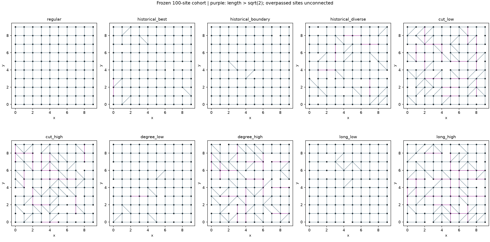
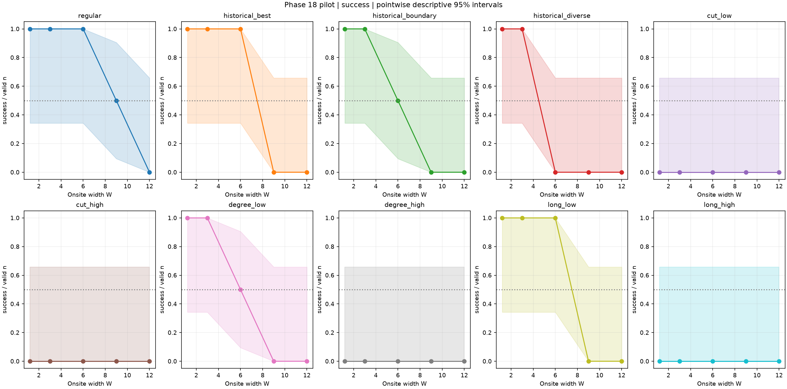
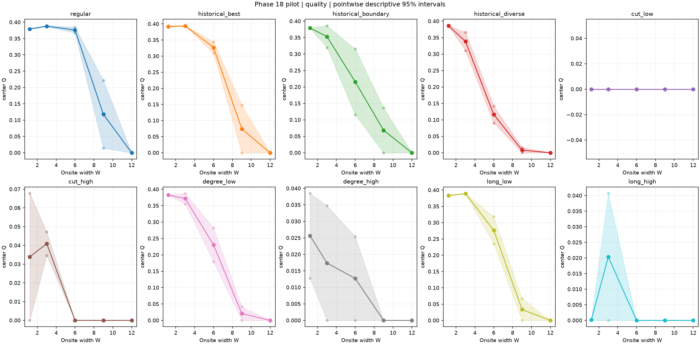
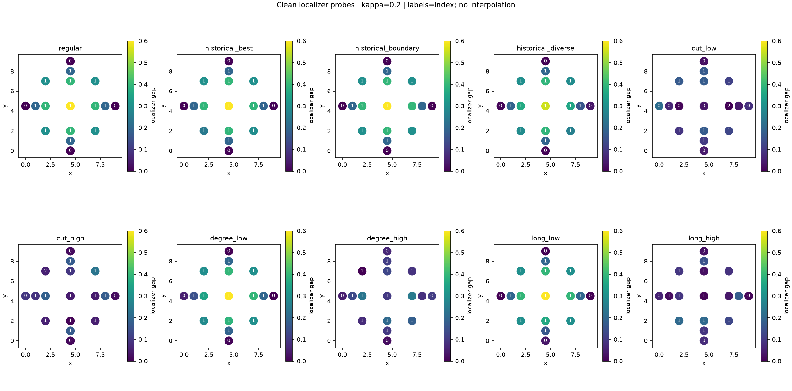
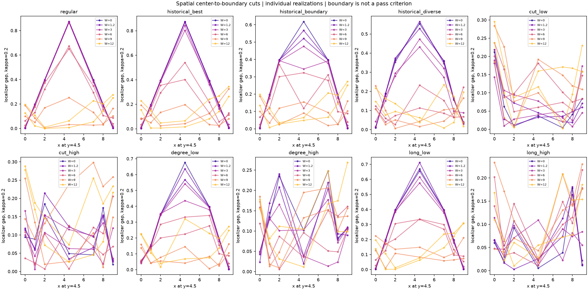
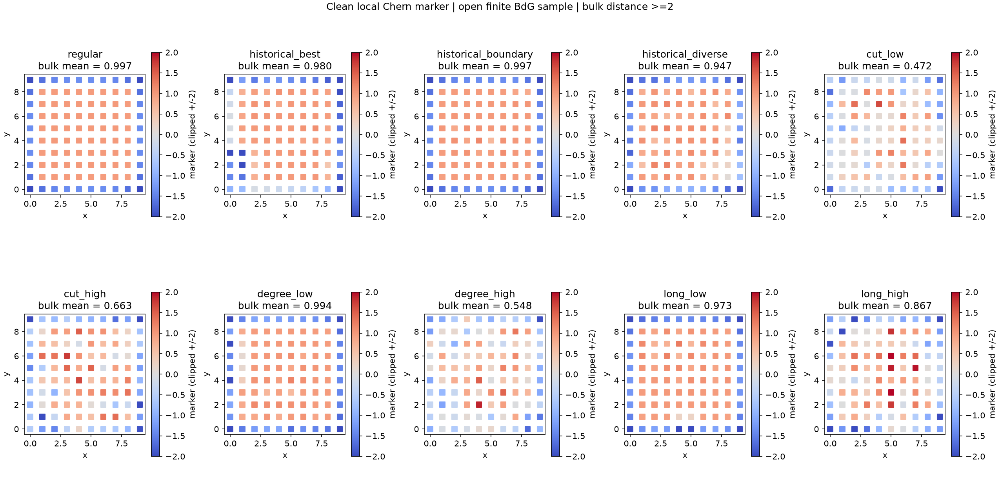
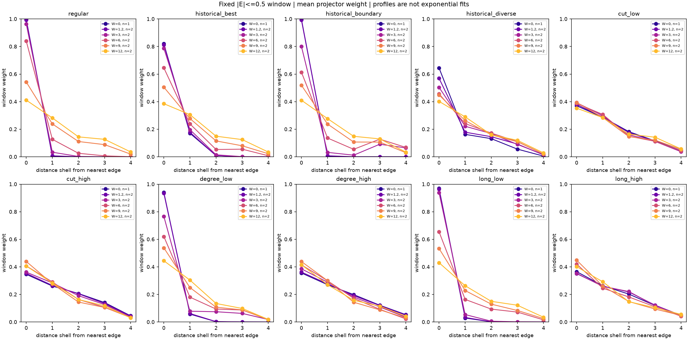
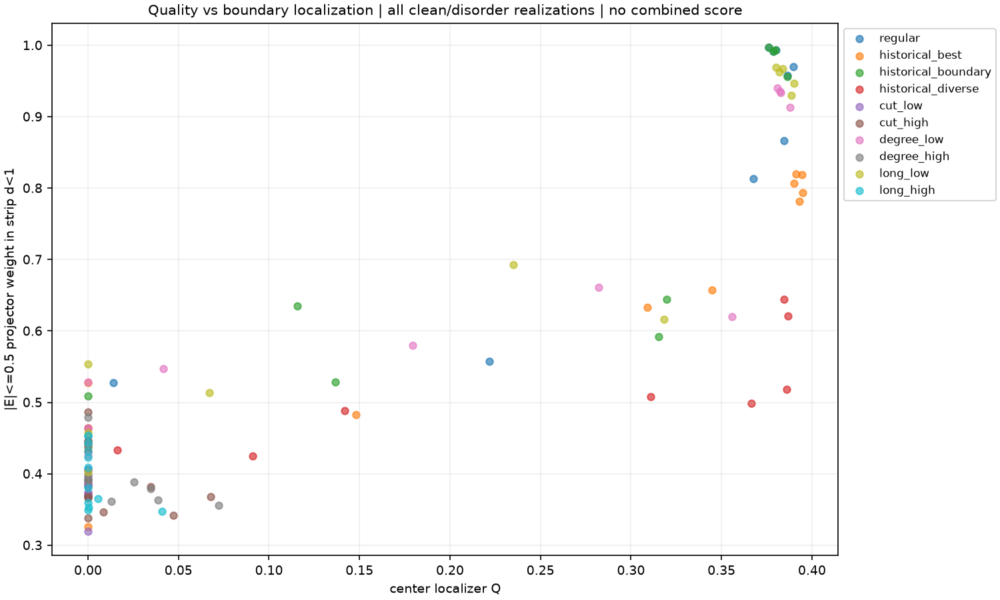

# Phase 18: Pilot abgeschlossen, Bestätigung vorbereitet

Stand 25.09.2026. **Erstes Etappenziel erreicht.** Zehn feste 100-Orte-Geometrien,
110/110 Realisierungen vollständig, 110 verbuchte Versuche. Keine fehlgeschlagene
Rechnung, keine numerisch ungültige Zentrumsauswertung, keine ungültige räumliche
Probe, kein fehlender Chern-Marker und kein leeres Randfenster im Pilot.
**Der große Bestätigungslauf wurde nicht erstellt oder gestartet.**

Der historische Spitzenkandidat hat bei schwacher Unordnung wieder einen höheren
Qualitätswert als das reguläre Gitter. Bei stärkerer Unordnung kehrt sich dieser
Vergleich in den beiden Pilot-Seeds um. Das ist ein Hinweis auf einen begrenzten
Gültigkeitsbereich des bisherigen Vorteils, noch keine statistische Bestätigung
oder Widerlegung. Die beiden neuen Seeds sind nicht Teil der späteren Bestätigung.

## Vorher festgelegt und tatsächlich geprüft

Der [unveränderte Nutzerplan](../roadmap/phase18_user_plan.md), das
[vor dem Pilot gespeicherte Protokoll](phase18_validation_protocol.md) und der
[Bearbeitungsstand](../roadmap/phase18_status.md) dokumentieren die Etappe.

- 100 feste quadratische Orte, 180 Kanten, Grad 2-6, Bindungslänge höchstens 2.
- Überquerungen fester Orte explizit unverbunden; keine überlappenden Bindungen
  oder unerlaubten Kreuzungen zwischen Orten.
- Hopping 1, chemisches Potential 2, Paarung 1, Chiralität +1, offene Grenzen.
- Unverändertes Phase-17-Zentrumskriterium: gültiger konsistenter nichtnull
  Localizer-Index und Q als kleinste Lücke bei kappas 0.1/0.2/0.3; Erfolg Q>=0.20.
- Pilot: W=1.2,3,6,9,12, Seeds 180101/180102; dieselben Onsite-Felder pro Seed
  und Breite für alle Kandidaten. Je Geometrie genau eine zusätzliche saubere Rechnung.
- 120 Versuche und 3600 s Obergrenze; ein Worker, ein BLAS-Thread.

Der erneute read-only Audit von Experiment 002 bestätigt 254 vollständige
Kandidaten und 4.572 abgeschlossene Stufen. Kandidaten- und Versuchsdigests stimmen
mit der Phase-17.2-Verifikation überein. Keine historische Kampagne wurde verändert
oder fortgesetzt. Das ist ein Prüfsummen-/Evidenzaudit, keine Neuberechnung aller
historischen Eigenprobleme und keine vollständige Dateisicherung des Experiments.

## Eingefrorene Kandidaten und Kontrollpaare

Die vollständige [Kohorte](../../examples/phase18_validation_cohort.json) enthält
Geometrien, Herkunftsprüfsummen, Deskriptoren, symmetriereduzierte Distanzen und
sämtliche Kantenänderungen der Kontrollpaare. Es waren keine Ersatzkandidaten nötig.

| Rolle | Historische ID / Auswahl |
|---|---|
| regular | Reguläres Quadratgitter |
| historical_best | ad56ec121716...; höchster historischer Q-Mittelwert |
| historical_boundary | 1bbbaa6eeed9...; höchstes sauberes Randgewicht bei Q über Referenz und Randgewicht >=0.97 |
| historical_diverse | 4810c130d7c4...; größte Mindestdistanz zu den beiden anderen unter Q>=95% des historischen Bestwerts |
| cut_low / cut_high | Kleinster/größter ausgewogener Achsenschnitt-Leitwert im strukturellen Pool |
| degree_low / degree_high | Kleinste/größte innere Gradvarianz im verbleibenden Pool |
| long_low / long_high | Kleinster/größter Langbindungsanteil im verbleibenden Pool |

Die sechs Kontrollen wurden aus 96 gesäten Geometrievorschlägen ohne neue
physikalische Zielwerte ausgewählt. Die Unterschiede der Paarmerkmale betragen
0.039545 beim Schnitt-Leitwert, 1.365234 bei der Bulk-Gradvarianz und 0.10 beim
Langbindungsanteil. Weitere Eigenschaften ändern sich ebenfalls. Das sind
reproduzierbare strukturbezogene Vergleiche, keine isolierten kausalen Eingriffe.

Zusätzlich sind [reversible Interventionen](../../examples/phase18_prepared_interventions.json)
in drei Ausgangsgraphen vorbereitet, mit 24 geometrischen Vorschlägen je Elternteil
und null Exakt-Aufrufen. Für Schnittanbindung und Langbindungen wurden je drei
Vorwärts-/Rückbau-Paare gefunden. Eine weitere Senkung der inneren Gradvarianz war
in allen drei ausgewählten Ausgangsgraphen innerhalb dieses begrenzten Pools
nicht verfügbar. Fehlende Vergleiche wurden nicht durch gelockerte Ziele ersetzt.
Diese zusätzlichen Geometrien sind noch nicht physikalisch getestet.

## Ergebnisse unter Onsite-Unordnung

Q-Mittel aus jeweils zwei gemeinsamen Pilot-Seeds:

| W | regulär | bisheriger Spitzenkandidat | randnaher historischer Vertreter | strukturell verschiedener Vertreter |
|---:|---:|---:|---:|---:|
| 1.2 | 0.379270 | 0.392265 | 0.379248 | 0.386247 |
| 3 | 0.387919 | 0.393950 | 0.353137 | 0.338565 |
| 6 | 0.376132 | 0.326811 | 0.215395 | 0.116355 |
| 9 | 0.117857 | 0.074091 | 0.068348 | 0.008018 |
| 12 | 0 | 0 | 0 | 0 |

Das reguläre Gitter besteht 2/2 bei W=1.2,3,6, 1/2 bei W=9 und 0/2 bei W=12.
Der Spitzenkandidat besteht ebenfalls 2/2 bis W=6, aber bereits 0/2 bei W=9.
Über das gleichgewichtete gesamte Pilotraster liegt seine gepaarte mittlere
Q-Differenz bei -0.014812. Der niedrige-W-Vorteil ist also keine allgemeine
Robustheitsüberlegenheit über den untersuchten Bereich.

Die Strukturkontrollen cut_low/cut_high, degree_high und long_high erreichen im
Pilot keinen Q>=0.20-Erfolg. degree_low und long_low schneiden besser ab. Wegen
der gleichzeitig veränderten Deskriptoren und nur einer Geometrie pro Rolle
belegt dies weder eine kausale Wirkung gleichmäßiger Grade noch eine generelle
Schädlichkeit langer Bindungen.

Alle Nenner, Einzelqualitäten, Verteilungen, gepaarten Differenzen und Intervalle
stehen in der [maschinenlesbaren Zusammenfassung](phase18_pilot_summary.json)
und den [Kurvendaten](phase18_pilot_curves.csv). Wilson-Intervalle sind mit zwei
Seeds breit; Bootstrap-Intervalle können bei zwei Seeds irreführend eng sein.
Die Pilotintervalle sind deskriptiv und nicht als Signifikanzbeleg zu verwenden.
Eine Bestätigung darf bei fehlenden/ungültigen primären Paaren keinen positiven
Überlegenheitsanspruch ableiten. Kein W50 wurde angepasst oder ausgegeben.

## Räumliche Topologie

Je Realisierung sind 17 Probeorte mit drei Skalen gespeichert: neun innere
Gitterproben sowie Mittelachsenschnitte bis zum Rand; das Zentrum wird nicht
doppelt gerechnet. Die Karten zeigen diskrete Proben ohne Flächeninterpolation.

Im sauberen System haben reguläres Gitter und alle drei historischen Vertreter
an sämtlichen neun Innenproben Index +1 über alle drei Skalen. Der gute zentrale
Index ist damit nicht auf einen einzigen geprüften Ort beschränkt. Die kleinste
Localizer-Lücke der neun Innenproben beträgt aber etwa 0.09831 beim regulären
Gitter und 0.09571 beim historischen Spitzenkandidaten. Dessen höherer zentraler
Q-Wert bedeutet hier keinen höheren schlechtesten Innenwert.

Unter W=9 bleiben bei kappa=0.2 für das reguläre Gitter jeweils 8/9 Innenproben
bei Index +1; beim Spitzenkandidaten 5/9 beziehungsweise 8/9. Das ist eine
separate räumliche Diagnose, keine zusätzliche nachträgliche Erfolgsdefinition.
Die Lücken allein sind stets gemeinsam mit Index und Gültigkeit zu lesen.

Der ergänzende lokale Chern-Marker verwendet den negativen BdG-Energieprojektor,
Nambu-Summe pro Ort, Ortsfläche 1 und den expliziten Bulk-Bereich Randabstand >=2.
Saubere Bulk-Mittel: regulär 0.99686, Spitzenkandidat 0.97975, randnaher Vertreter
0.99668, verschiedener Vertreter 0.94721. Das sind deskriptive endliche Werte,
keine vorausgesetzte Quantisierung und kein Beweis einer Mobilitätslücke.

## Randzustände und Zielkonflikt

Das historische Randgewicht betraf vier Zustände mit kleinstem |E| auf der
äußersten Reihe. Die neue Diagnose verwendet das vorab festgelegte Fenster
|E|<=0.5, beide BdG-Vorzeichen und vollständig einbezogene nahe Entartungsgruppen.
Gespeichert werden Energien, Einzelgewichte, Gruppenprojektoren, das gesamte
Fensterprojektorprofil, Streifen d<1/<2/<3 und die mittlere Distanz zum Rand.

| Saubere Geometrie | Zustände im Fenster | Randgewicht d<1 | Randgewicht d<2 |
|---|---:|---:|---:|
| regulär | 4 | 0.997067 | 0.999988 |
| historischer Spitzenkandidat | 4 | 0.819853 | 0.990316 |
| randnaher Vertreter | 4 | 0.996841 | 0.999953 |
| verschiedener Vertreter | 6 | 0.644713 | 0.807526 |

Der Spitzenkandidat besitzt vor allem mehr Gewicht in der zweiten Reihe;
der Verlust auf der äußersten Reihe bedeutet deshalb nicht, dass das gesamte
niederenergetische Gewicht tief im Inneren liegt. Beim verschiedenen Vertreter
ändert auch die Zahl der Zustände im festen Fenster den Vergleich zum alten
Vier-Zustands-Wert. Bei W=9 umfasst das reguläre Fenster 16/14 Zustände, das des
Spitzenkandidaten 14/18. Diese Zählungen sind keine unabhängigen Teilchenzahlen.

Die Randprofile sind mit niederenergetischen Randzuständen vereinbar. Chiralität,
geschützter Transport und isolierte Majorana-Nullmoden werden nicht zertifiziert.
Localizer-Lücke, Bulk-Spektrallücke und Mobilitätslücke bleiben getrennte Begriffe.

## Verifikation und Rechenbudget

- 141 relevante Tests bestanden in 93.46 s, darunter 21 neue Tests.
- Referenzgleichheit des alten Zentrumsergebnisses, gleiche Unordnungsfelder,
  Entartungsrotationen, Fehlernenner und gepaarte Seed-Blöcke geprüft.
- Pause, Safe Stop, Versuchslimit, Zeitlimit, Konfigurations-/Quellabweichung,
  echter Prozessabbruch exit 73 und identische Wiederaufnahme geprüft.
- Abgeschlossenen Pilot erneut geöffnet: weiterhin 110 Versuche und identische
  Versuch-/Ergebnisdigests, null neue Exakt-Aufrufe.
- Artefaktaudit: SQLite-Integrität, Payload-Prüfsummen, Deskriptoren, rekonstruierte
  Hamiltonidentitäten, Felder, Zentrumskonsistenz, Qualitätsarithmetik und
  Randprojektorgewichte geprüft. Keine neue Diagonalisierung im Audit.
- Ruff bestanden. Scoped strict Mypy der fünf neuen Laufzeitmodule bestanden
  mit Python 3.14, silent imports und ignorierten fehlenden Fremdstubs.
  Keine neue vollständige Repository-Regression oder manuelle GUI-Prüfung behauptet.

Der Pilot brauchte rund **149 s gesamte Laufzeit**, davon **127.16 s Exakt-Stufen**:
11.99 s bisherige Primärauswertung und 114.55 s Zusatzdiagnostik. Insgesamt
5.610 Localizer-Diagonalisierungen (Dimension 400) und 5.940 Hamilton-Diagonalisierungen
(Dimension 200), da die wiederverwendeten Funktionen Spektren zusätzlich bestimmen.
Mittlere vollständige Stufe 1.156 s, P95 1.215 s. Parallel liefen fokussierte Tests;
die Schätzung ist rechner- und lastabhängig. Eine Speicherstichprobe im Lauf
ergab 97.5 MB RSS; dies ist keine gemessene Spitzenbelegung.

| Bestätigungsvorschlag | Umfang |
|---|---:|
| Unordnungsraster nach eingefrorener Pilotregel | 6, 6.75, 7.5, 8.25, 9 |
| Neue Seeds pro Breite/Kandidat | 181001-181050, 50 Stück |
| Saubere Referenzen | 10, jeweils einmal |
| Geplante Realisierungen | 10 × (5 × 50 + 1) = **2.510** |
| Vorgeschlagenes Versuchslimit inklusive Reserve | **2.560** |
| Numerische Zeitprojektion | **48.4 min** |
| Projektion mit beobachtetem Verwaltungs-/Berichtsanteil | **ca. 57 min** |
| Vorgeschlagenes kooperatives Laufzeitlimit | **7.200 s / 2 h** |
| Rohe Ergebnisprojektion | ca. **394 MB** |
| Praktischer freier Plattenplatz mit DB/WAL/Exporten | **2 GB einplanen**, keine harte Garantie |

Eine Exakt-Stufe bezeichnet eine komplette Realisierung mit Zusatzdiagnostik,
nicht eine einzelne Matrixdiagonalisierung. Die Bestätigung umfasst planmäßig
128.010 Localizer- und bei anwendbarem Chern-Marker 135.540 Hamilton-Diagonalisierungen.
Es werden keine externen bezahlten Dienste genutzt. Nicht vorhersehbare
Solverfehler oder Rechnerlast können ein höheres Zeit-/Speicherbudget erfordern;
automatisch nachgerechnet wird nicht.

Die [startbereite Bestätigungskonfiguration](../../examples/phase18_validation_confirmation.json)
hat bewusst noch `null` für Rechenlimits. Die
[CLI-Anleitung](../phase18_validation_usage_de.md) enthält Erstellung, Start,
Pause, Wiederaufnahme und Berichtexport. Beide konkreten Budgets müssen beim
Erstellen ausdrücklich angegeben werden. **Dieser Schritt steht noch aus.**

## Offene fachliche Fragen und nächste Entscheidung

1. Reproduziert sich die beobachtete Rangumkehr im vorab ausgewählten Übergangsbereich
   auf 50 neuen Seeds? Das neue Raster bestätigt diesen Bereich, nicht den ursprünglichen
   Mittelwert über W=0,0.4,0.8,1.2. Eine separate genaue Wiederholung des alten
   Niedrig-W-Endpunkts wäre ein zusätzliches, vorab zu budgetierendes Protokoll.
2. Zwei Seeds grenzen den Übergang nur grob ein. Das reguläre Q-Mittel steigt
   zwischen W=1.2 und 3; weder Qualitätskurven noch Erfolgsanteile werden monoton erzwungen.
3. Neun Innenproben belegen keine räumlich durchgängige Schutzregion. Kleinste
   Innenlücke und niedrigenergetische Randprofile können dem Zentrumsvorteil widersprechen.
4. Die Kontrollen verändern mehrere Merkmale. Einzelgraphen und vorbereitete
   Eingriffe begründen noch keinen allgemeingültigen geometrischen Mechanismus.
5. Größenfortsetzung, Nachbarparameter, entfernungsabhängige Kopplungen und
   Chiralitäts-/Transportdiagnostik bleiben zurückgestellt. Hopping-Unordnung
   und Kantenausfälle sind im allgemeinen Paket vorhanden, im eingefrorenen
   Forschungsadapter jedoch nicht auswählbar; getrennte Folgestudien sind skizziert.

Die wissenschaftliche Bestätigung selbst ist mit dem Pilot noch nicht erreicht.
Die vorliegende Etappe liefert dafür geprüfte Infrastruktur, vollständige
Pilotdaten, ein festes Raster und eine belastbare erste Aufwandsschätzung.

Methodische Quellen: [Cerjan/Loring, Localizer-Tutorial](https://arxiv.org/abs/2411.03515)
und [Bianco/Resta, lokaler Chern-Marker](https://arxiv.org/abs/1111.5697).
Die gezeigten numerischen Befunde stammen ausschließlich aus dem lokalen Pilot.
