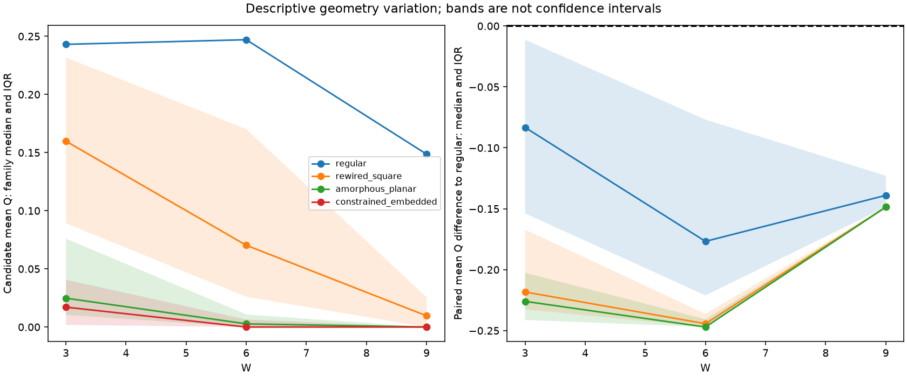
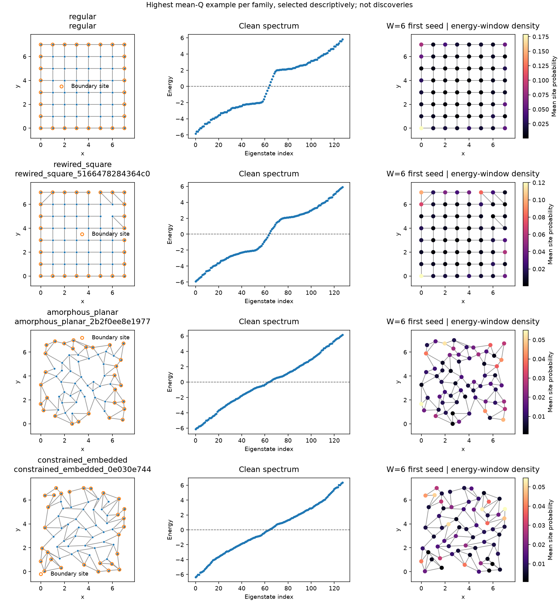
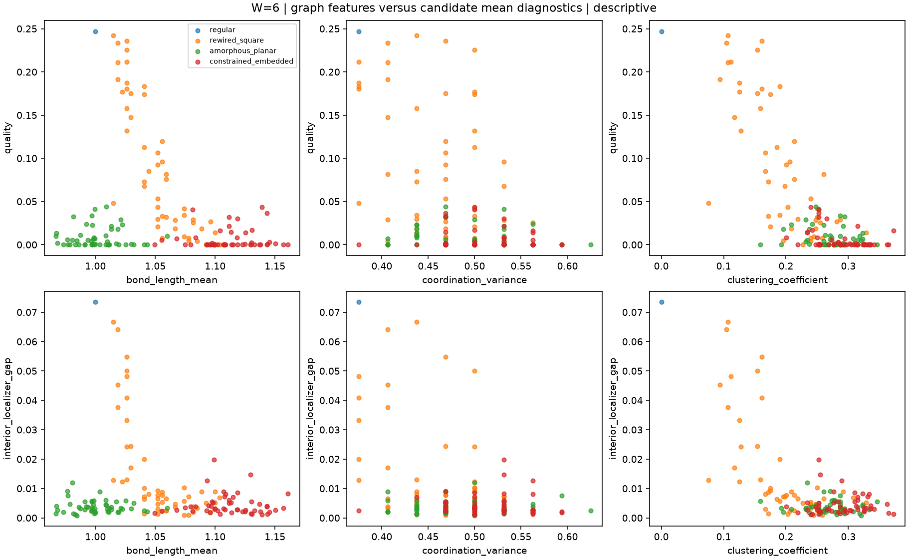

# Phase 19: eingebettete Graphen — Forschungsbericht

Abgeschlossen am 26.09.2026. **Kein belastbarer Nachweis verbesserter Robustheit.**
Die erweiterten Geometriefamilien erzeugen deutlich unterschiedliche Physik,
schneiden unter den hier festgelegten Modellparametern aber überwiegend schlechter
ab als das reguläre Gitter. Einzelne neue umverdrahtete Gitter zeigen bei W=3
höhere Scores. Dieser Hinweis braucht unabhängige Bestätigung.

## Ergebnis und Aussagegrenze

151 eingefrorene Geometrien: eine reguläre Referenz und jeweils 50 umverdrahtete,
amorphe planare sowie räumlich eingebettete Zufallsgraphen. Pro Geometrie eine
Clean-Referenz und W=3/6/9 mit drei neuen Seeds: **1510/1510 vollständige Ergebnisse,
null numerisch ungültige Ergebnisse**. Maximaler numerischer Residualwert:
2,08e-14 bei Toleranz 1e-10. Keine PHS-Verletzung.

Die folgenden Werte sind Mittel über die drei Seeds und danach über die
Geometrien einer Familie. Die Erfolgsraten sind deskriptive Anteile nach dem
unveränderten Kriterium Q>=0,20 mit erfüllter topologischer Zulässigkeit.
Regulär hat nur drei Disorder-Realisierungen pro W; jede Zufallsfamilie 150,
mit denselben drei Seed-Vektoren. Das sind **keine 150 unabhängigen Disorder-Seeds**.

| Familie | Q bei W=3 | Q bei W=6 | Q bei W=9 | Erfolg W=3 / 6 / 9 |
|---|---:|---:|---:|---:|
| Regulär | 0,2431 | 0,2471 | 0,1486 | 100 / 100 / 0 % |
| Umverdrahtetes Quadratgitter | 0,1571 | 0,0901 | 0,0213 | 36 / 13,3 / 0 % |
| Amorph-planar | 0,0404 | 0,0084 | 0,0024 | 0 / 0 / 0 % |
| Eingebetteter Zufallsgraph | 0,0263 | 0,0061 | 0,0032 | 0 / 0 / 0 % |

Die Grafik zeigt Familienmediane und Interquartilsbereiche der Kandidatenmittel,
also andere Lagewerte als die Tabelle. Die Bänder sind **keine Konfidenzintervalle**.

**Gesichertes Ergebnis dieses Datensatzes:** Bei W=6 und W=9 liegt keine der 150
Zufallsgeometrien im mittleren Q über der regulären Referenz. Beide Familien mit
freien Koordinaten erreichen in keiner der 900 Disorder-Realisierungen das
Erfolgskriterium. Das ist eine Beobachtung für dieses Ensemble und diese Seeds,
kein allgemeiner Unmöglichkeitsnachweis für amorphe Supraleiter.

**Statistisch unsicherer Trend:** Bei W=3 haben 12/50 umverdrahtete Gitter einen
höheren mittleren Q als die Referenz. Alle zwölf liegen bei W=6 darunter. Damit
gibt es einen deskriptiven Vorzeichenwechsel zwischen den Messpunkten, aber mit
drei Seeds und Auswahl aus 50 Kandidaten keinen bestätigten Cross-over und keine
präzise Cross-over-Stärke. Auch der kleine Anstieg des regulären Mittelwertes von
W=3 auf W=6 ist kein belegter disorderinduzierter Verbesserungseffekt.

## Physikalische Diagnostiken und Score

| Familie, W=3 | kleinster Interior-Localizer-Gap, gemittelt | Randgewicht | Zentrumgewicht | Chern-Bulk-Mittel |
|---|---:|---:|---:|---:|
| Regulär | 0,08964 | 0,9612 | 0,00009 | 0,9930 |
| Umverdrahtet | 0,03872 | 0,6157 | 0,02841 | 0,7225 |
| Amorph-planar | 0,00379 | 0,5518 | 0,06275 | 0,4515 |
| Eingebetteter Zufallsgraph | 0,00336 | 0,5476 | 0,07127 | 0,4199 |

Rand- und Zentrumgewicht stammen aus dem vollständigen Niedrigenergiefenster
|E|<=0,5 einschließlich nahezu entarteter Gruppen. Randgewicht: Abstand zur
Boxkante <1 nach der vorhandenen Streifendefinition; Zentrum: [2,5;4,5]^2.
Die Zahl der darin liegenden Sites ist gespeichert. Der Interior-Wert ist der
kleinste spektrale Localizer-Gap über die inneren Proben und alle drei Kappas.
Er ist **kein Bulk-Spektralgap**; dieser bleibt ohne validierte Bulk/Edge-Trennung
explizit nicht verfügbar.

Die schwächeren Scores der freien Graphfamilien gehen mit kleineren
Interior-Gaps, weniger konsistenter innerer Topologie, kleineren Chern-Mitteln
und weniger auf den Rand konzentrierter Niedrigenergie-Dichte einher. Schon
ohne Disorder liegen ihre mittleren Q bei 0,0612 beziehungsweise 0,0361, gegenüber
0,2315 regulär. Ein erheblicher Unterschied besteht also bereits im sauberen
System. Der Versuch trennt den Verlust des Ausgangszustandes nicht kausal von
zusätzlicher Disorder-Empfindlichkeit.

**Welche Größe verursacht den Unterschied?** Der Score ist definitionsgemäß der
kleinste Center-Localizer-Gap, wenn die drei lokalen Indizes konsistent und
nicht null sind; sonst null. Unterschiede in Gap und Zulässigkeit erklären
somit rechnerisch Q. Eine verursachende geometrische Eigenschaft ist hier nicht
isoliert: Winkel, Schleifen, Randkonnektivität und Längen ändern sich gemeinsam.

**Scoreproblem?** Unter den 80 erfolgreichen Disorder-Realisierungen findet sich
kein Fall mit räumlich inkonsistenter/nicht durchgehend nichttrivialer innerer
Topologie nach dem dokumentierten Prüfkriterium. Das beweist keine universelle
Eignung des Scores. Das ausgewählte umverdrahtete Beispiel hat bei W=3
Q=0,2662 gegenüber 0,2431 regulär, aber nur Randgewicht 0,8662 gegenüber 0,9612.
Höherer Q bedeutet folglich nicht automatisch stärkere Randlokalisierung.
Bei überwiegend trivialen freien Graphen kann außerdem ein endlicher
Interior-Localizer-Gap bei W=9 steigen, während Q nahe null bleibt: Ein invertierbarer
trivialer Localizer ist kein Robustheitsnachweis. Score und Rohgrößen bleiben getrennt;
der Score wurde nicht geändert. Es wurde kein neues schwerwiegendes Scoreversagen
festgestellt, das die bekannten Interpretationsgrenzen erweitert.

Majorana-Polarisation und Selbstkonjugation sind separat gespeichert. Die
Selbstkonjugation einzelner endlicher-Energie-Eigenzustände liegt hier nahe null;
Polarisation allein liefert keinen Majorana-Nachweis. Keine neue Phase oder
räumlich getrennten Majorana-Moden werden behauptet.

## Beispiele und strukturelle Hinweise

Die Beispiele wurden ausschließlich für die Abbildungen nach höchstem mittleren
Q über W=3/6/9 je Familie gewählt. Sämtliche übrigen Ergebnisse bleiben enthalten.

| Beispiel-ID | Q bei W=3 / 6 / 9 |
|---|---|
| `rewired_square_5166478284364c0f` | 0,2662 / 0,2421 / 0,1409 |
| `amorphous_planar_2b2f0ee8e197712a` | 0,1213 / 0,0131 / 0,0155 |
| `constrained_embedded_0e030e7445959fbf` | 0,1088 / 0,0434 / 0,0176 |

Die Farbskalen der Lokalisierungsbilder sind pro Bild angegeben und unterscheiden
sich. Farben verschiedener Zeilen dürfen nicht ohne Beachtung der Skala gleichgesetzt
werden. Vollständige Kandidaten-IDs und Daten stehen in der Kohorte und den CSV-Dateien.

Nur die reguläre Referenz sowie `rewired_square_5166478284364c0f` und
`rewired_square_7bf4a7befb2e3950` erfüllen das Robustheitskriterium in allen drei
Seeds sowohl bei W=3 als auch bei W=6. Bei W=9 erfüllt es keine Realisierung.
Das ist eine Beschreibung dieser neun Seed/W-Bedingungen, keine bestätigte
Robustheit über einen kontinuierlichen Disorder-Bereich.

Innerhalb der umverdrahteten Familie korreliert Q bei W=3 deskriptiv mit mittlerer
Kantenlänge (Spearman rho=-0,876) und Clustering (-0,779); Gradvarianz: -0,244.
Bei den amorphen Graphen ist die Längenkorrelation dagegen -0,052, bei den
eingebetteten Zufallsgraphen +0,036. Die Längenbeziehung ist somit kein universelles
Prinzip dieser Untersuchung. Clustering bei eingebetteten Zufallsgraphen:
rho=-0,376. Keine kausale Schlussfolgerung oder korrigierte Signifikanzbehauptung;
alle berechneten Merkmalskorrelationen werden exportiert, nicht nur diese Beispiele.
Der mittlere Grad ist für alle Graphen exakt 3,5 und kann hier keine Variation erklären.

## Umsetzung, Fairness und Reproduzierbarkeit

Die vorhandenen `Geometry`/`GeometryEdge` speichern Site-Indizes, freie 2D-Koordinaten,
Kanten, Randinformationen und Metadaten. Eine neue Graphdarstellung war unnötig.
Hamiltonian, richtungsabhängiges antisymmetrisches p+ip-Pairing, Disorder und Q
werden unverändert weiterverwendet. Bestehende APIs behalten ihre Standardwerte.

- Neu: `research/embedded.py` mit explizitem Bereich und versioniertem Adapter;
  `embedded_cohort.py` mit Komposition bestehender Generatoren und Constraints;
  `embedded_study.py` als Erweiterung des vorhandenen Validierungslaufs;
  `embedded_reporting.py` für deskriptive Exporte.
- Generalisiert: vorhandener Hard-Core-Generator um den bestehenden Radius-Kantenpool,
  direkter Zugang zur bestehenden Constraint-Prüfung, Anwendbarkeit des
  Quadratgitter-Referenzdeskriptors und kleine Adapter-/Diagnostik-Hooks.
- Tests: `tests/test_embedded_research.py`. Zusätzlicher datenlesender Audit:
  `scripts/phase19_report_audit.py`. Keine neuen Suchalgorithmen oder GPU-Abhängigkeiten.

Alle Geometrien: N=64, E=112, Grade 2..4, zusammenhängend, Box [0;7]^2,
Mindestabstand 0,55, Kantenlänge höchstens 1,75, keine geraden Kantenkreuzungen,
24..32 Rand-Sites. Physikalischer Randstreifen <=0,875. Marker-Flächen aus der
vorhandenen Voronoi-Clippingroutine in [-0,5;7,5]^2. t=1, mu=2, Delta=1,
Kappas 0,1/0,2/0,3. Keine abstandsabhängige Kopplung neu eingeführt.

150 vollständige Vorschläge akzeptiert; intern 5689 verworfene
Konstruktionsversuche: 472 amorph und 5217 beim Radius-Kantenpool. Gründe sind
überwiegend Gradgrenzen und nicht erreichbare Kantenbudgets; Details stehen im
[Kohortenprüfbericht](phase19_cohort_verification.json) und im Rejection-Export.
Alle drei Familien wurden vor der Physikauswertung eingefroren, ohne Nachauswahl.
Kohorten-Hash: `d9e367921b35dd7c39186128b8223fa500de521e711d28e7081cd965b6553178`.

**Grenzen:** N=64 ist keine Größenextrapolation und nicht mit den alten N=100-Daten
zu poolen. Die zwei freien Familien teilen einen Punktprozess; es werden keine
gleichverteilten Stichproben aller gültigen Graphen gezogen. Randanteile, örtliche
Dichte und Längenverteilungen sind begrenzt, nicht exakt gleich. Gemeinsame Seeds
koppeln iid-Potentiale nach lexikographischem Site-Index, nicht nach identischen
räumlichen Punkten. Marker und Localizer bleiben endliche Systemdiagnostiken;
ein Mobility-Gap ist nicht unabhängig belegt.

## Prüfungen, Laufzeit und technischer Vorfall

- Vor Änderungen: vollständige Suite **3140 bestanden**, 868,24 s.
- Nach Erweiterung: vollständige Suite **3150 bestanden**, 1184,23 s.
- Danach isolierte Rundungskorrektur: **63 relevante Tests bestanden**, 46,16 s;
  die gesamte Suite wurde danach nicht nochmals wiederholt.
- Abschlussprüfung des neuen Graph-Moduls: **11 Tests bestanden**, 42,96 s;
  alle 1510 exportierten JSONL-Rohdatensätze stimmen exakt mit den
  Datenbankprüfsummen überein.
- Quadratgitter-Hamiltonian exakt gleich; Spektren, Disorder, Score, räumliche
  Localizer und Chern-/Randdiagnostiken innerhalb 1e-10 gleich.
- Drei feste historische Fälle vor und nach der Erweiterung reproduziert;
  alle 2510 alten Ergebnisprüfsummen im Abschlussaudit erneut unverändert.
  Das ersetzt keine Neuberechnung aller 2510 historischen Eigensysteme.

Checkpoint vor Erweiterung `c666246`; Implementierung `ee6f526`; ausgewerteter
Quellstand `e0af133`. Das Manifest enthält vollständige Hashes und `source.zip`.
Ein erster Start stoppte nach 53 Versuchen wegen eines Randabstands von
-8,88e-16 durch affine Rundung. Der getrennte Ersatzlauf toleriert diesen
Rundungsrest konsistent zur Domain-Prüfung; keine Koordinate wurde verändert.
Siehe [Vorfallbericht](phase19_roundoff_incident.md). Der erste Lauf bleibt erhalten.
Eine spätere Sitzungsunterbrechung wurde mit dem bestehenden Resume-System
wiederaufgenommen: ein unterbrochener Versuch, keine doppelten Ergebnisdatensätze.

Ersatzlauf: 1510 vollständige Ergebnisse aus 1511 Versuchen, protokollierte aktive
Laufzeit 1009,6 s, davon 823,6 s exakte Auswertung, im Mittel **0,545 s pro
Realisierung**. Mit Erststart: 1564 von maximal 1600 Versuchen und rund 1069 s
protokollierte aktive Zeit. Sitzungspause nicht als Rechenzeit gezählt; bei
hartem Prozessende kann Zeit seit dem letzten gespeicherten Zustand fehlen.
Großer Abstand zur 1800-s-Grenze; Tests und Berichtserstellung separat.

## Dateien und empfohlener nächster Versuch

Vollständige Daten unter `results/phase19-exploration-v2/`: SQLite, Kohorte,
Seeds, Protokoll, Manifest, Quellarchiv, Checkpoints und Rohdatenexport
`reports/realizations.jsonl`. Tabellen: `realization_diagnostics.csv`,
`candidate_statistics.csv`, `family_statistics.csv`, `baseline_differences.csv`,
`feature_correlations.csv`, `rejections.csv`. Alle zwölf skalaren Diagnostiken
für Clean/W=3/6/9 als Einzelwerte in `plots/raw_diagnostics_W*.png`;
Kandidatenmittel in `family_distributions_W*.png`.
Der [Abschlussaudit](phase19_exploratory_audit.json) enthält Quantile und Prüfsummen;
[Bedienung und Architektur](../phase19_embedded_usage_de.md) erläutert die Wiederverwendung.

**Empfehlung, nicht gestartet:** Fünf jetzt festgelegte Geometrien — regulär,
die beiden oben genannten über W=3/6 erfolgreichen umverdrahteten Gitter sowie
die beiden freien Familienbeispiele — bei W=3/4,5/6/7,5/9 mit 50 frischen,
gepaarten Seeds 192001..192050 und einer Clean-Referenz je Geometrie (192000).
Das sind 1255 Realisierungen. Vorschlag: höchstens **1300 Versuche / 1800 Sekunden**;
erwartet etwa 11–15 Minuten reine Auswertung bzw. rund 15–20 Minuten mit
Speicherung bei vergleichbarer Hardware. Vor Start Analyseplan festschreiben:
simultane Intervalle der vier Baseline-Kontraste je W, vorab definierter
Vorzeichenwechsel und getrennte Auswertung von Interior-Gap, Randgewicht und Q.
Die Auswahl aus diesem Pilotlauf muss in der unabhängigen Studie offengelegt werden.
Dieser Versuch würde ausgewählte Kandidaten prüfen, keine Familienüberlegenheit
oder geometrische Kausalität beweisen.

**STOPP:** Diese Entwicklungsstufe ist abgeschlossen. Keine weitere Suche,
Bestätigung oder nächste Entwicklungsphase wurde automatisch gestartet.
