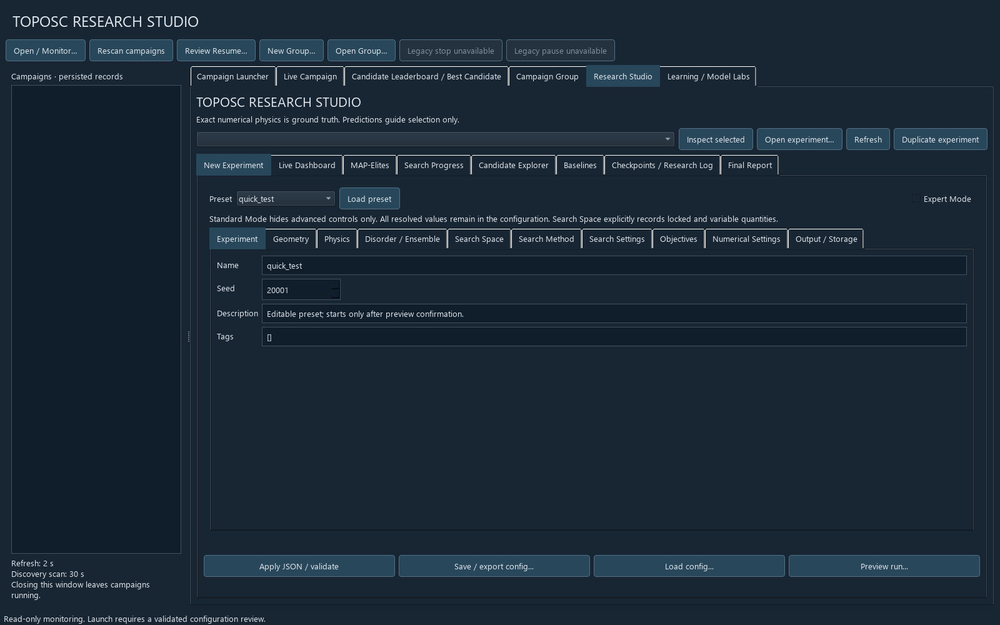
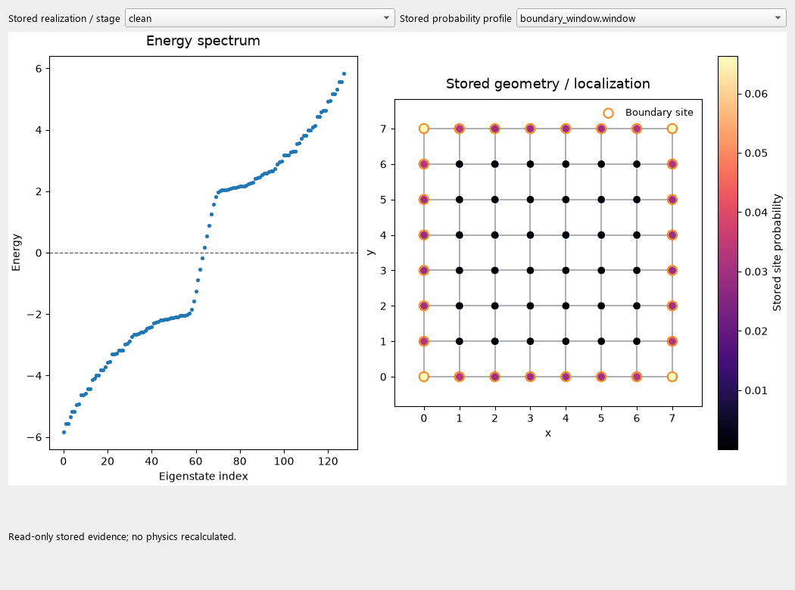

# Phase 20 — TOPOSC Research Studio

Abgeschlossen am 27.09.2026. Umsetzung auf Basis von `cf3806a`.
**Vollständige Suite: 3.243 Tests bestanden**, 977,80 s.
Diese Entwicklungsstufe erzeugt keine neuen physikalischen Aussagen.

## 1. Bestehende Oberfläche erweitert

TOPOSC LIVE wurde inkrementell zum Research Studio erweitert. Dessen
Prozessentkopplung, Monitoring, Kampagnen, Gruppen, Ergebnisansichten und
Backend bleiben erhalten. Die bestehenden Streamlit-Modell- und Lehrlabore
werden im selben Fenster eingebettet; ihr doppelter Forschungsbereich wurde
aus der Navigation entfernt. Es gibt einen unterstützten Anwendungseinstieg.
Das vorangegangene [Architekturaudit](phase20_architecture_de.md) dokumentiert
die Entscheidung und die vorhandenen Komponenten.

## 2. Windows-Start

Im Projektordner **`start_toposc.bat` doppelklicken**. Voraussetzung ist die
vorhandene Projektumgebung mit den Extras `[live,app]`; Einrichtung siehe
[Bedienung](../phase20_studio_usage_de.md). Der Launcher installiert nichts.
Der entsprechende Modulaufruf ist:

```powershell
.venv\Scripts\python.exe -B -m toposc_live --root results
```

`toposc-live` und `toposc-ui` sind Aliasse derselben Anwendung.
Das Öffnen des Studios startet keine wissenschaftliche Rechnung.

## 3. Neue Dateien

- `src/toposc_lab/research/studio_config.py`, `studio_physics.py`,
  `studio_space.py`, `studio_results.py`.
- `src/toposc_live/studio_editor.py`, `labs.py`; `start_toposc.bat`.
- `tests/test_studio_config.py`, `test_studio_geometry.py`,
  `test_studio_physics.py`, `test_studio_runtime.py`, `test_studio_ui.py`.
- `scripts/phase20_audit.py`.
- `docs/roadmap/phase20_user_plan.md`, `docs/phase20_studio_usage_de.md`,
  dieser Bericht, `phase20_architecture_de.md`,
  `phase20_compatibility_audit.json`, `phase20_test_verification.json`
  und Oberflächenbilder unter `figures/phase20/`.
- Generiertes Prüfprotokoll: `output/phase20_validation/full-tests.log`.

## 4. Geänderte Dateien

- `README.md`, `pyproject.toml`.
- `src/toposc_lab/app/streamlit_app.py`.
- `src/toposc_lab/geometry/generators/hard_core_planar.py`.
- `src/toposc_lab/research/config.py`, `engine.py`, `service.py`, `__main__.py`,
  `physics.py`, `validation_diagnostics.py`.
- `src/toposc_live/research_page.py`, `window.py`, `__main__.py`.
- `tests/test_research_ui.py`: bestehende Fälle an die ausdrückliche
  Startvorschau und raumabhängige Algorithmusauswahl angepasst; keine Tests gelöscht.

Historische Forschungsberichte und Ergebnisdateien wurden nicht verändert.

## 5. Eine ExperimentConfig

Schema 2 erweitert die vorhandene Dataclass. Aufgelöste Defaults,
Generatorparameter, Physik, Disorder, Suchraum, Algorithmus, Budgets,
Ausgabe und Locks werden gemeinsam als JSON gespeichert und gehasht.
Formularmetadaten stammen aus dieser Konfiguration. Standard/Expert verändert
nur die Sichtbarkeit. Backend-Validierung gilt gleichermaßen für UI und CLI.
Schema 1 behält seine frühere Serialisierung und seine Konfigurationshashes.

## 6. Ein Experimentrunner

UI und CLI verwenden `ResearchService.run_experiment()` und die bestehende
`ResearchEngine`. Strategien schlagen Geometrien vor; der versionierte
Physikadapter delegiert an die vorhandene exakte Auswertung. `ResearchStore`,
SQLite-Transaktionen, Versuchszählung, Manifest, Quellarchiv, Kontrollen und
Checkpoint/Resume werden wiederverwendet. Keine zweite Datenbank oder Engine.
Preview berechnet keine Physik. START übernimmt genau die geprüfte
Konfiguration; Änderungen nach der Vorschau erfordern eine neue Prüfung.

## 7. Geometrien

Reguläres Quadratgitter, umverdrahtetes Quadratgitter, amorph-planarer Graph
und räumlich eingebetteter Radiusgraph. Freie Generatoren akzeptieren nun
explizite Site-/Kantenzahl, Box, Abstands-, Grad-, Längen-, Kreuzungs- und
Randbedingungen. Ihre bisherigen Defaults erzeugen dieselben Archive.
Zusätzlich sind verlustfrei archivierte feste Kandidaten auswählbar.

## 8. Suchmethoden

Für `fixed_connectivity`: vorhandene Zufallssuche, Evolution, MAP-Elites und
Surrogat-MAP-Elites. Für freie Familien: `embedded_random` als ergebnisunabhängige
Komposition vorhandener Generatoren. Für Folgeexperimente: `fixed_candidates`.
Beide neuen Adapter verwenden dieselbe Strategie-Schnittstelle einschließlich
Checkpoint/Resume. Nicht unterstützte Kombinationen werden abgelehnt.
Modell-Parameterscans bleiben in den bestehenden Model Labs verfügbar.

## 9. Oberflächenbereiche

Zehn Konfigurationsbereiche: Experiment; Geometry; Physics; Disorder / Ensemble;
Search Space; Search Method; Search Settings; Objectives; Numerical Settings;
Output / Storage. Hinzu kommen Live Dashboard, MAP-Elites, Search Progress,
Candidate Explorer, Baselines, Checkpoints / Research Log und Final Report.
Die vorhandenen Kampagnen-, Gruppen- und Modellansichten bleiben erreichbar.



## 10. Expert Mode

Zeigt zusätzliche Generator-, Such-, Diagnostik-, Numerik- und Ausgabefelder
sowie das vollständige JSON. t, mu, Delta, Chiralität, Kappas, Domain,
Energiefenster, Gruppentoleranz, Majorana-Toleranzen, Anzahl naher Zustände,
Wilson-Konfidenzniveau und CPU-/Laufbudgets sind im anwendbaren Adapter
konfigurierbar. Kleine Toleranzen unterstützen Exponentialschreibweise.
Unveränderliche Definitionen sind als solche gekennzeichnet.
Aktuelle Strategien variieren keine Physikparameter; entsprechende Locks
werden validiert. Ein fester Experimentwert bleibt trotzdem editierbar.

## 11. Presets und Speichern/Laden

`quick_test`, `phase19_like`, `disorder_scan`, `candidate_validation` und
`broad_random_search` sind gewöhnliche bearbeitbare Konfigurationen.
Save/export und Load verwenden dasselbe JSON wie die CLI. Das Phase-19-Preset
ist keine identische Wiederholung der eingefrorenen historischen Kohorte.
Clone erzeugt eine bearbeitbare Konfiguration und startet keinen Lauf.

## 12. Candidate Explorer

Gespeicherte Kandidaten lassen sich filtern, sortieren und vergleichen.
Details zeigen Geometrie, Herkunft, exakte Stufen, Spektren und gespeicherte
Ortsprofile; die Profilwahl unterscheidet Energiefenster und einzelne Zustände.
Das Öffnen berechnet keine Physik nach. Rohobservablen bleiben von Zielwerten,
Surrogatprognosen und numerischer Gültigkeit getrennt. Fehlende Werte sind
keine Nullwerte; numerisch ungültiges Q wird nicht als erfolgreicher Messwert exportiert.



## 13. Folgeexperimente

Kandidaten wählen → Create follow-up experiment → W-Werte und frische Seeds
eingeben → Konfiguration prüfen → Preview → START. Geometriearchive behalten
die ursprüngliche Site-Reihenfolge. Quelllauf, Kandidaten-ID und physischer
Hash werden gespeichert; überlappende Disorder-Seeds werden abgelehnt.
Das Klonen eines historischen Laufs mit denselben Seeds ist separat als
abhängige Wiederholung gekennzeichnet. Es ist keine unabhängige Bestätigung.

## 14. Rückwärtskompatibilität

Phase 18 und 19 werden über einen lesenden Adapter geöffnet, ohne Migration.
Der [Kompatibilitätsaudit](phase20_compatibility_audit.json) prüft alle
Objektprüfsummen, SQLite-Integrität und Konfigurationshashes: 2.510 plus 1.510
exakte Ergebnisse, insgesamt **4.020**. Beide Datenbanken sind nach dem Lesen
bytegleich. Drei Generatorarchive für Seed 190001 stimmen bytegenau mit dem
Quellstand vor Phase 20 überein. Regressionstests vergleichen den neuen und
historischen Physikadapter einschließlich Spektren, Disorder, Q, Localizern,
Chern und Ortsdiagnostiken. Keine Neuberechnung aller historischen Eigensysteme.
Fortsetzen historischer Studien erfordert weiterhin deren passenden Quellstand.
Auch Folgekonfigurationen aus echten historischen Kandidaten und das Klonen
der vollständigen Kohorten (10 beziehungsweise 151 Geometrien) wurden ohne
Laufstart geprüft. Dabei entstand kein Experimentverzeichnis.

## 15. Verifikation

- Vorher: **95 relevante bestehende Tests bestanden**, 174,60 s.
- Nachher: **vollständige Suite 3.243 Tests bestanden**, 977,80 s,
  einschließlich **92 neuer Studio-Testfälle**. Kein Fehler, kein übersprungener Test.
  Der Python-Quellstand wurde während dieses abschließenden Gesamtlaufs nicht geändert.
- Neue Integration: kleiner echter Clean-/Disorder-Lauf, Pause nach einer
  exakten Stufe, Resume ohne doppelte Ergebnisse, Export und Folgeexperiment.
- UI: Formular/JSON, Presets, Locks, Vorschauidentität, Kandidatendetails,
  Plotprofile, historische Kontrollen und wissenschaftliche Zahlendarstellung.
  Regressionen verhindern die Verwechslung von Chern-Marker und Localizer-Index
  in Filtern sowie die stille Übernahme alter Werte bei ungültiger Eingabe.
- Native Standard-/Expert-Ansichten gerendert und visuell geprüft.
  Zusätzlich den echten historischen Kandidaten `regular` aus Phase 19
  mit zehn gespeicherten Stufen geöffnet; 13 Ortsprofile der Clean-Stufe
  verfügbar, Fensterdichte und Spektrum korrekt dargestellt, keine neue Auswertung.
  Interne Streamlit-Labore: AppTest ohne Ausnahme, Dienst erreicht Healthy,
  Dienstende beim Schließen geprüft. QtWebEngine-Bilddarstellung konnte im
  Offscreen-Test ohne Grafikkontext nicht visuell bestätigt werden.
- Ruff für neue Module und geänderte native UI; `git diff --check` ohne Fehler.
  Im älteren Streamlit-Modul bestehen unverändert zwei Stilhinweise
  (Importreihenfolge und verschachtelte `with`-Blöcke); gegen `cf3806a` geprüft.

Der [Prüfnachweis](phase20_test_verification.json) speichert Befehl,
Laufzeitumgebung, Quellhash und Ergebnis. Befehl:
`.venv/Scripts/python.exe -B -m pytest -q`;
Qt im Offscreen-Modus, OMP/OpenBLAS/MKL/BLIS mit je einem Thread.
Testprotokoll lokal: `output/phase20_validation/full-tests.log`.
Es wurden nur kleine technische Testläufe gestartet, keine Forschungskampagne.

## 16. Weiterhin feste wissenschaftliche Definitionen

Q-Zulässigkeit und Erfolgsschwelle 0,20; p+ip-/Nambu-Konvention; offene 2D-Ränder;
uniformer skalarer Onsite-Disorder; dichter vollständiger Solver;
Wilson-Intervallmethode; vorhandenes Domain-Probenrezept; Voronoi-Clipping;
Domain-Rundungstoleranz 1e-10; Breite 1 der radialen Histogrammbins.
Die skalaren Vergleichsexporte verwenden Randstreifenbreite 1 und Zentrum-
Halbbreite 1. Andere Randstreifen stehen separat in den Rohdaten.
Diese Definitionen werden offengelegt, nicht als neu validierte Optionen angeboten.
Rohdaten, Ablehnungen und Konfiguration werden verbindlich gespeichert.

## 17. Bekannte Grenzen

Ein exakter Worker je Lauf; harte Speicherschranke anhand einer konservativen
8-GiB-Schätzung, keine zuverlässige Laufzeitprognose vor Messungen. Zeitlimits
und Pause sind kooperativ zwischen exakten Stufen; eine laufende Erzeugung
oder Diagonalisierung kann sie überschreiten. Dichte Matrizen begrenzen N.
Freie Generatoren liefern keine uniforme Verteilung gültiger Graphen.
Keine Parameteroptimierung von t/mu/Delta, gewichtete Ziele, Pareto-Suche,
neue ML-Methoden, Bulk-Gap-Definition oder vollständige Eigenvektorarchive.
Das Studio ist auf diesem Windows-System geprüft, kein getestetes Standalone-
Installationspaket. Headless-Tests ersetzen keinen vollständigen manuellen
Bedienungstest der eingebetteten Browserlabore auf einem sichtbaren Desktop.
Fachliche Anerkennung und unabhängige Reproduktion lassen sich durch diese
Implementierung allein nicht bescheinigen.

## 18. Empfehlung und Stopp

Als nächste separate Entwicklungsstufe: unabhängiger Reproduktions- und
Bedienungstest auf einer frischen Umgebung, anschließend versioniertes Release
mit nachvollziehbarer Umgebung und dokumentierter Zitierweise. Neue physikalische
Bestätigungsstudien benötigen einen eigenen vorab festgelegten Analyseplan.
Weder die vorgeschlagene 1.255-Realisierungen-Studie noch eine neue Suche oder
die nächste Entwicklungsphase wurde automatisch begonnen.
