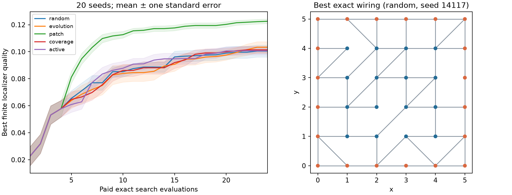

# Phase-14 Gate Report — Generative Geometry

**Block D complete; GENERATOR_GATE validation PASS. Phase 15 has not started.**

Reproducible best-quality advantage under the frozen rule: patch.
The Phase-13/13R null result remains accepted. AL is technically validated and optional; it has no presumed superiority. The scoped portfolio decision is stated below.
Select the simple nonlearning patch generator for maximizing the declared finite localizer quality within this 36-site wiring stratum. Preserve Random and Evolution as mandatory comparison baselines; Evolution remains the established baseline outside this scoped result. Coverage and AL stay optional and are not promoted for physics quality. No method demonstrates success-threshold efficiency, a general topological advantage, or superiority in other search spaces.

## Scope, constraints and branch decisions

Mandatory tasks 14.1, 14.2, 14.12–14.15 and feasibility task 14.9 are complete. RL 14.3–14.8 was ineligible because Gate 13 failed. Learned/conditional generation 14.10–14.11 was not built: the audited 1,440 Phase-13R records cover only 60 clean-chain geometries and zero compatible planar records. Earlier 64-site graph work and geometric REINFORCE demo rewards do not establish an independently split training corpus for this stratum.

The search expands clean chains to 36-site, 60-edge planar wiring on a 6×6 unit grid, fixed outer perimeter, degrees 2–6, connected, no crossings, edge length ≤√2. Random and Evolution have the same support as the new patch and coverage methods. Evolution wraps existing Phase-10 fitness/tournament/rewiring APIs. Patch correlates spatial edge priorities; coverage selects distant wiring patterns from random proposal pools. Neither learns physics.

The existing chiral p-wave model uses t=Δ=1, μ=2, chirality +1. Quality is the minimum center spectral-localizer gap at κ=0.1,0.2,0.3, gated by agreement on a nonzero index and PHS residual ≤10⁻¹⁰. Novelty cannot improve physics fitness. Localizer disagreement remains unresolved. This is finite-system local evidence, not a thermodynamic phase or Majorana claim.

## 1–3. Fair comparison, exact candidate quality and success

Seeds 14101–14120: 20 seeds × five arms × 24 exact search evaluations = 2,400. The same four initial geometries are simulated and charged independently to every arm. There are 300 independent winner/μ-sensitivity evaluations and four positive/trivial reference evaluations: **2,704 gate evaluations**. Each evaluation includes the BdG eigensystem and three localizer calculations; these are not single matrix solves.

| Method | Mean best ± seed SD | Best exact | Candidate success | Successful seeds | Improved warm best |
|---|---:|---:|---:|---:|---:|
| random | 0.100499 ± 0.019702 | 0.148033 | 0.00% | 0/20 | 16/20 |
| evolution | 0.103365 ± 0.018195 | 0.143100 | 0.00% | 0/20 | 18/20 |
| patch | 0.122561 ± 0.007480 | 0.132746 | 0.00% | 0/20 | 20/20 |
| coverage | 0.101414 ± 0.011216 | 0.120912 | 0.00% | 0/20 | 17/20 |
| active | 0.100756 ± 0.013667 | 0.127082 | 0.00% | 0/20 | 19/20 |

Success means quality ≥0.20; the threshold was not changed after development. If no arm reaches it, first-hit/sample-savings comparisons are censored at the budget and cannot establish success efficiency.

Best exact candidate: **random, seed 14117**, quality **0.148033441**. Its complete reproducible geometry, parameters, spectrum and raw diagnostics are in [phase_14_best_candidate.json](phase_14_best_candidate.json).

```json
{
  "alternate_quality": 0.12445198860699482,
  "boundary_weight": 0.8407018544428501,
  "boundary_weight_minimum": 0.8092769113433838,
  "boundary_weights": [
    0.8092769113433838,
    0.8092769113433842,
    0.8721267975423164,
    0.872126797542316
  ],
  "eligible": 1.0,
  "localizer_gap": 0.14803344128397533,
  "minimum_abs_energy": 0.08333375756864714,
  "phs_mismatch": 3.552713678800501e-15,
  "polarization_norms": [
    0.9136008840368098,
    0.91360088403681,
    0.7465822608167515,
    0.7465822608167512
  ],
  "quality": 0.14803344128397533,
  "success": 0.0
}
```

## 4–6. Structural novelty, diversity, duplicates and invalid geometries

Novelty is edge-Jaccard distance minimized over the eight rigid symmetries of the square. Coordinates anchor site labels; reflections are conservatively grouped. Within each arm, proposals at distance ≤0.06 from prior simulations or batch members are rejected. This is wiring novelty relative to an explicit archive, not literature novelty or general abstract graph-isomorphism. Descriptor cells are (triangle count // 4, integer diameter), a descriptive coverage measure rather than a tuned reward.

| Method | Mean pairwise distance | Novelty to warm | Descriptor cells | Raw duplicates / proposals | Raw invalid / proposals |
|---|---:|---:|---:|---:|---:|
| random | 0.4366 | 0.4070 | 5.65 | 0/1227 (0.00%) | 747/1227 (60.88%) |
| evolution | 0.3439 | 0.1947 | 5.00 | 26/1237 (2.10%) | 731/1237 (59.09%) |
| patch | 0.3495 | 0.3706 | 8.70 | 8/1256 (0.64%) | 768/1256 (61.15%) |
| coverage | 0.4470 | 0.4187 | 5.85 | 0/3172 (0.00%) | 1892/3172 (59.65%) |
| active | 0.4353 | 0.4054 | 5.80 | 0/3172 (0.00%) | 1892/3172 (59.65%) |

All arms evaluate 24 distinct, separated structures per seed. Accepted duplicate and invalid-geometry rates are zero. Raw proposal rates include the common warm start; coverage and AL inspect more proposals per exact call, so counts and denominators are both shown. Full rejection reasons and raw edge proposals remain in the per-arm audit.

## 7–8. OOD behavior and computational cost

The common OOD detector uses only each arm's four identical warm-start geometries, including the training feature envelope. Flags are stored before exact evaluation. They warn about extrapolation and never declare physics invalid. AL additionally uses its evolving training reference; OOD exploitation count is zero.

| Method | Post-warm common OOD | Exact quality OOD / ID | Mean search wall s | Mean exact-evaluator s |
|---|---:|---:|---:|---:|
| random | 83.0% | 0.03092 / 0.02624 | 2.044 | 0.953 |
| evolution | 79.5% | 0.04341 / 0.03269 | 2.268 | 0.954 |
| patch | 99.2% | 0.06951 / 0.02712 | 1.947 | 0.901 |
| coverage | 84.7% | 0.02921 / 0.02641 | 3.571 | 0.913 |
| active | 79.0% | 0.03141 / 0.02658 | 5.019 | 0.926 |

The ID quality column includes warm-start records. These are descriptive, differently selected subsets, not a causal effect of OOD. Patch explores predominantly OOD geometries relative to the small common reference; exact verification is essential.
All exact calls have BdG dimension 72 and localizer dimension 144; the declared cubic work proxy per 24-call search is 250,822,656. All four numerical thread limits are one. Wall time includes search/record persistence and pre-exact OOD, excluding winner confirmations and report derivation; evaluator timing includes validation and record construction. Runtime does not measure memory or a general hardware speedup.

AL prequential selected-prediction diagnostics (descriptive, raw Gaussian intervals are not a calibration guarantee):

```json
{
  "all": {
    "count": 400,
    "mae": 0.028934667638549082,
    "raw_90_coverage": 0.8525
  },
  "ood": {
    "count": 118,
    "mae": 0.028009175871079466,
    "raw_90_coverage": 0.864406779661017
  },
  "id": {
    "count": 282,
    "mae": 0.029321930151178215,
    "raw_90_coverage": 0.8475177304964538
  }
}
```

## 9–10. Seed robustness and reproducible advantage

Positive differences favor the tested method. Simultaneous paired-bootstrap intervals use 50,000 resamples and Bonferroni correction for six comparisons. A method must have positive lower bounds and ≥16/20 strict wins against both baselines. Seeds share the same physical search stratum; they are repeated searches, not independent materials.

| Comparison | Mean best-quality difference | Simultaneous interval | Wins / ties / losses |
|---|---:|---:|---:|
| patch − random | +0.022062 | [+0.008038, +0.034097] | 16 / 0 / 4 |
| patch − evolution | +0.019196 | [+0.006738, +0.031655] | 18 / 0 / 2 |
| coverage − random | +0.000915 | [-0.010580, +0.011191] | 7 / 9 / 4 |
| coverage − evolution | -0.001951 | [-0.015224, +0.012284] | 8 / 2 / 10 |
| active − random | +0.000257 | [-0.015056, +0.014036] | 10 / 4 / 6 |
| active − evolution | -0.002609 | [-0.012276, +0.008773] | 6 / 1 / 13 |

| Method | Winner mean quality μ=1.9 / 2.0 / 2.1 | Sensitivity success | Alternate-weight winner changes |
|---|---:|---:|---:|
| random | 0.099212 / 0.100499 / 0.079340 | 0.0% | 3/20 |
| evolution | 0.101764 / 0.103365 / 0.084750 | 0.0% | 7/20 |
| patch | 0.123544 / 0.122561 / 0.108010 | 0.0% | 6/20 |
| coverage | 0.097069 / 0.101414 / 0.082564 | 0.0% | 3/20 |
| active | 0.100784 / 0.100756 / 0.076385 | 0.0% | 3/20 |

Sensitivity checks are two nearby chemical potentials, not disorder ensembles or finite-size scaling. Alternate ranking multiplies quality by boundary weight; stored Pareto record IDs preserve the quality/boundary tradeoff. These diagnostics cannot replace the frozen primary endpoint or establish general physical robustness.

| Seed | Random | Evolution | Patch | Coverage | Active |
|---|---:|---:|---:|---:|---:|
| 14101 | 0.079497 | 0.095570 | 0.132746 | 0.093835 | 0.093835 |
| 14102 | 0.098138 | 0.125372 | 0.126442 | 0.098138 | 0.110464 |
| 14103 | 0.098142 | 0.123631 | 0.105660 | 0.098142 | 0.108504 |
| 14104 | 0.098430 | 0.080250 | 0.132184 | 0.098430 | 0.098430 |
| 14105 | 0.119688 | 0.066087 | 0.117362 | 0.110605 | 0.115220 |
| 14106 | 0.099430 | 0.143100 | 0.120556 | 0.112883 | 0.118932 |
| 14107 | 0.077690 | 0.109089 | 0.128266 | 0.082431 | 0.104536 |
| 14108 | 0.103210 | 0.083559 | 0.129187 | 0.103210 | 0.081602 |
| 14109 | 0.083310 | 0.103509 | 0.124034 | 0.111870 | 0.083310 |
| 14110 | 0.107730 | 0.113246 | 0.120390 | 0.084443 | 0.107730 |
| 14111 | 0.098324 | 0.098324 | 0.126902 | 0.098324 | 0.103369 |
| 14112 | 0.072786 | 0.117877 | 0.121657 | 0.088624 | 0.088624 |
| 14113 | 0.080129 | 0.094762 | 0.126165 | 0.118393 | 0.091276 |
| 14114 | 0.104655 | 0.104655 | 0.124133 | 0.104655 | 0.104655 |
| 14115 | 0.120912 | 0.096864 | 0.108791 | 0.120912 | 0.075732 |
| 14116 | 0.114811 | 0.076622 | 0.130043 | 0.114811 | 0.097196 |
| 14117 | 0.148033 | 0.101889 | 0.113173 | 0.098268 | 0.098268 |
| 14118 | 0.133955 | 0.105973 | 0.128333 | 0.108645 | 0.088027 |
| 14119 | 0.088868 | 0.117148 | 0.117347 | 0.088868 | 0.127082 |
| 14120 | 0.082242 | 0.109767 | 0.117851 | 0.092791 | 0.118324 |

## Validation, provenance and decision

All 100 arm/seed winners were exactly revalidated. A fresh-timestamp repeat of seed 14101 reproduced all **135 scientific records exactly**, adding 135 evaluations. The audit validated 2704 exact records and 3409 inventory files, equal budgets, no label leakage, geometry separation and OOD handling. Gate plus reproduction: **2,839 evaluations**. Development: **306** non-test attempts (274 complete campaign, 31 before a reporting serialization failure, one failed diagnostic); **3,145 total non-test evaluations/attempts**. Test simulations are separate.

Full suite: `2767 passed in 645.51s (2026-09-14); python -B -m pytest -q -p no:cacheprovider --basetemp=results/pytest-phase14-full`. Focused regression: 35 passed; final generator checks: 14 passed. Changed-source/tests/audit Ruff PASS. Isolated Mypy PASS with Python 3.14; the repository's default 3.11 type target remains incompatible with its installed NumPy stubs.

Source SHA-256: `cc39f9fe9fa28be032c7a12631ae34010f45d92b8543eae1330db36e5d923f52`. Protocol SHA-256: `808de33b174eb1c7d9da5bdad2a7272ed8f460de5442718bce5b5bb0b41cff37`. Base commit: `c628ed3e4ae3f4944ba2dfed09abd1d7e9fdfe82` with explicitly recorded dirty worktree. Source snapshots and per-file inventories accompany both runs; historical Phase-13 reports and pre-existing user changes were preserved.

Keep Random and Evolution as fair supported baselines. Measured diversity alone does not establish better physics. No RL or learned architecture is added for prestige. The benchmark supports decisions only within this finite wiring stratum, not a global optimal-generator claim. A further scientific block needs a separate user instruction; **do not start Phase 15**.

Artifacts: [protocol](phase_14_protocol.md), [feasibility](phase_14_feasibility.json), [machine-readable gate summary](phase_14_generator_gate.json), [usage](../phase_14_usage_de.md); full curves and ledgers in `results/phase14-gate/`, reproduction in `results/phase14-repeat/`.


