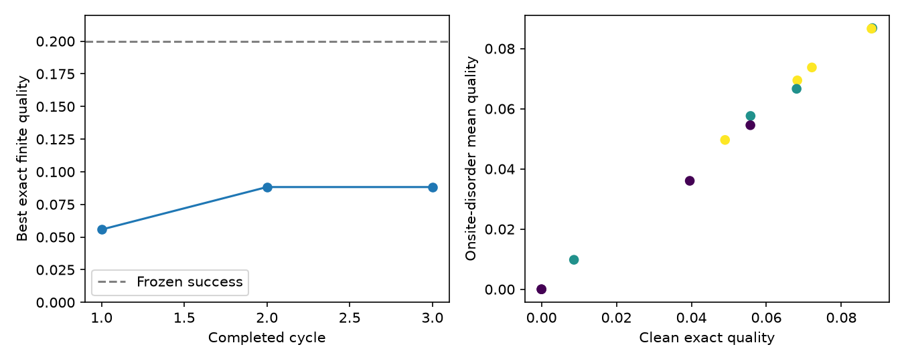

# Phase-15 Gate Report — Autonomous Discovery Engine

**Block E complete; AUTONOMY_GATE PASS. Phase 16 has not started.**

The loop is operationally trustworthy for small, monitored exact discovery
campaigns in the validated finite wiring stratum. It does not certify Majorana
physics, robustness beyond the tested ensemble, or a thermodynamic phase. This
gate validates autonomous orchestration; it is not a new generator-superiority
benchmark or authorization for a large search.

## Scope and generator policy

Tasks **15.1–15.23** are implemented. The search uses the Phase-14 6×6 unit grid,
36 sites, 60 planar edges, fixed perimeter, degrees 2–6, connected, no crossings,
and edge length ≤√2. Patch is the default only for this stratum and the frozen
finite-localizer objective, based on the accepted Phase-14 comparison. Random
and Evolution remain supported baselines; coverage and surrogate acquisition
are optional. Evolution retains its established baseline role outside this
scoped result. Unsupported spaces fail closed pending an exact adapter and fair
baseline benchmark. No RL or learned generator was added.

All arms use the same random warm pool in cycle 1. The primary seed is **15201**,
with three cycles, eight valid proposals and four selected exact candidates per
cycle. The model remains chiral p-wave, t=Δ=1, μ=2, chirality +1; component-major
Nambu basis, κ=(0.1,0.2,0.3), center (2.5,2.5), tolerance 10⁻¹⁰. Quality remains
the minimum localizer gap gated by agreeing nonzero indices and PHS. **Success
remains quality ≥0.20; all clean candidate success counts are zero.**

## Generation, selection and exact results

| Arm | Raw generated | Valid pool | Exact candidates | Invalid | Duplicate | OOD* | Best exact |
|---|---:|---:|---:|---:|---:|---:|---:|
| patch (default) | 42 | 24 | 12 | 18 | 0 | 12 | 0.088282573 |
| random | 61 | 24 | 12 | 37 | 0 | 12 | 0.131304059 |
| evolution | 54 | 24 | 12 | 29 | 1 | 11 | 0.070929704 |
| patch + optional surrogate | 42 | 24 | 12 | 18 | 0 | 12 | 0.112015076 |

*OOD counts include four initial candidates per arm with `reference_unavailable`,
conservatively flagged rather than called in-distribution. Later common flags
use only the first four completed exact records. Every selected OOD candidate
receives full exact verification. Surrogate OOD never drives exploitation.

Each arm performs 12 clean exact evaluations, 12 independent exact confirmations
and 48 exact disorder evaluations: **72**. Unselected proposals receive no physics
labels. The optional surrogate makes 16 predictions across cycles 2–3 using the
same four-label training prefix (two-cycle retraining cadence); no future label
enters training, and no prediction is stored as exact data.

The default campaign improves then stagnates: **0.055733830 → 0.088282573 → 0.088282573**. All four arms
improve in cycle 2 and do not improve their running best in cycle 3. Random wins
this one-seed smoke comparison; it neither overturns the 20-seed Phase-14 result
nor demonstrates a general Random advantage. There is no sample-efficiency or
success-threshold improvement claim. No runaway duplicates, invalid accepted
structures, OOD exploitation or numerical failures occurred in the gate.

## Best exact candidates and scientific validation

Default patch winner: quality **0.088282573**, geometry
`geometry-archive-v1-sha256:b7e403bd0fb7678a56a894abd58dc8bf73383db9c826321b4af775115dd099d6`.

Best across the four arms: **random**, quality **0.131304059**,
geometry `geometry-archive-v1-sha256:4e17dc005c4670fdaf1837335b9ec1a692bedbf6937ec7060974eb5920f30167`. Its
[complete candidate record](phase_15_best_candidate.json) contains explicit
coordinates/edges, model, full spectrum, raw diagnostics, disorder samples and
provenance. Every selected candidate, including both winners, passed independent
exact re-evaluation before dataset integration.

| Arm | Eligible / 12 | Unresolved topology | Mean / minimum distance | Winner disorder mean ± SD |
|---|---:|---:|---:|---:|
| patch (default) | 10/12 | 1 | 0.3848 / 0.1538 | 0.086794438 ± 0.001994327 |
| random | 8/12 | 2 | 0.4435 / 0.3784 | 0.132454102 ± 0.003439017 |
| evolution | 8/12 | 2 | 0.3709 / 0.0645 | 0.070509246 ± 0.001325311 |
| patch + optional surrogate | 10/12 | 1 | 0.3218 / 0.0952 | 0.113060274 ± 0.004028345 |

Topology applicability is limited to the 2D class-D finite center localizer.
Raw indices, signatures and gaps at every κ are retained. Conflicting indices
remain `unresolved`, with zero eligible quality; agreement on a trivial zero
index is distinguished from nonzero evidence. Known regular-grid μ=2 positive
and μ=8 trivial references pass. No other invariant is applied outside its domain.

The overall winner has localizer indices
`[1, 1, 1]` and minimum |E| =
**0.063254593**. Majorana validation retains the
operator PHS residual (**0**),
spectral PHS, four low-energy state profiles, IPR, boundary weights, complex
local polarization, particle/hole weights and self-conjugacy. The existing
splitting diagnostics and their tolerances are explicitly recorded. These
finite chiral boundary states do **not** establish spatially separated Majorana
zero modes; the report status is `diagnostics_only`, with `majorana_claim=false`.

Robustness uses four independent exact scalar onsite-disorder realizations per
candidate, uniform offsets in [-0.1,0.1] with opposite particle/hole signs.
The overall winner has mean quality **0.132454102**,
SD **0.003439017**, standard error
**0.001719509**, and minimum quality
**0.129058757**. Its frozen-success fraction is
**0%**, with 95% Wilson interval
**[0.0000,
0.4899]**. The wide interval and
four-sample ensemble do not certify robustness; no geometric disorder, hopping
or pairing ensemble was run in this gate.

Finite-size/family evidence is explicitly **unavailable**. The fixed wiring
stratum has no candidate-specific size-extension map; unrelated sizes or nearby
μ values are not substituted for scaling. No thermodynamic or size-stability
claim follows from these results.

## Diversity, dataset integrity and recovery

The symmetry-minimized edge-Jaccard exclusion radius stays at 0.06. Filtering
covers earlier valid pools, within-batch structures and an optional external
dataset. Accepted candidates exceed that radius; raw rejection denominators
appear above. Across the seven campaign instances, **325** raw
proposals yield 168 valid pool entries and 84 exact validated dataset records,
with **156 invalid** and **1 duplicate** rejections.
Repeated campaigns and shared warm starts are intentional: there are
**32 distinct exact geometries** across the four control arms, not
84 independent materials. External-dataset duplicate rejection is additionally
verified by a deterministic test that rejects the repeated warm candidates.

Exact records are appended atomically and reconciled from the journal without
duplicate labels. Base eigensystems, independent confirmations, each disorder
realization, failures and pre-exact selections have separate checksummed records.
Cycle commits include inventories; checkpoints identify stable cycle boundaries.
A single-writer OS lease is released by process termination. Completed exact
stages are reused. An interrupted unsaved calculation repeats the same seed and
consumes another attempt; it is never silently free.

Checkpoint after one cycle and resume, independent fresh-timestamp repeat, and
real killed-worker recovery each reproduce **all 12 complete scientific records
exactly**, including their stored disorder realizations. Timestamps and record
IDs are excluded from scientific equality; seeds/config/source are retained and
audited separately. Eight deterministic interruption-boundary tests, solver
failure isolation, retry-cap exhaustion and corruption rejection also pass.

The first gate's Windows kill harness terminated a venv launcher while its
interpreter child briefly retained the lock. The harness was corrected to
terminate the process tree, and that gate recovered with both interrupted
attempts charged. A final review then hardened JSON configuration arrays into
immutable tuples and rejected boolean numerical settings. This changed no
scientific endpoint. All seven campaigns and the full suite were rerun on the
final source. The final real kill/restart passes (exit code
1) with exactly one charged interruption. Final source
archives and `results/phase15-gate-final/gate-driver.py` preserve the executable
campaign implementation; the earlier gate is retained separately.

## Cost, limitations and acceptance

The final seven campaigns require 504 completed evaluations, two reference
evaluations and one interrupted attempt: **507 final-gate
numerical evaluations/attempts**. The earlier source gate used
**508**, including its two interruptions:
**1015 total Phase-15 non-test evaluations/attempts**. The initial CLI
import failure made zero numerical attempts. Test simulations are separate.
Each evaluation includes one 72-dimensional BdG
eigensystem and three 144-dimensional localizers, not one matrix solve. Each
campaign has an 80-attempt cap; final crash recovery uses 73.

The primary campaign records **1.534 s**
inside exact stages and **5.319 s** across
completed cycle invocations. Across all instances these measured totals are
**10.774 s** and **36.774 s**, respectively. Initialization,
report regeneration, reference runs and unrecorded interrupted time are outside
these sums. All four numerical thread limits are one. This is not a memory or
hardware-speedup measurement; the full suite ran concurrently for part of the gate.

Remaining limits: one geometry/model stratum, coarse four-point OOD reference,
small disorder ensembles, no finite-size sequence, no Majorana certification,
no success-threshold hit, single-writer storage and strict same-source/runtime
resume. Numerical stage failures are isolated and excluded from the accepted
dataset; raw exact successes before a later validation failure remain in the
journal. Source/config mismatch, corrupt committed artifacts, conflicting exact
confirmation and exhausted budget stop execution without weakening definitions.

**Acceptance: PASS for a bounded, monitored real discovery campaign in this
validated stratum.** Broader claims or large campaigns need additional physics,
family validation and a separately authorized protocol. The Pareto leaderboard
keeps clean quality, boundary weight and disorder quality separate, with an
alternate boundary-weighted ranking; novelty never compensates for physics.

Full suite: **2789 passed in 410.04 s** (2026-09-14),
`python -B -m pytest -q -p no:cacheprovider --basetemp=results/pytest-phase15-final`.
Subsystem/physics checkpoint: 128 passed; final ordering/cadence checks: 2 passed.
Final immutable-configuration checks: 3 passed. The earlier full suite had 2788
passes before the additional configuration regression was added.
Ruff and isolated Mypy (`--python-version 3.14`) pass. The repository's pre-existing
default Mypy 3.11 target remains incompatible with its installed NumPy stubs.

Base commit: `75eef61b2c24063f4f4b185116eb3bfde188c043` plus recorded dirty Phase-15 additions.
Source SHA-256: `b686f144804dbf2775b18de54dc8172d7f194e0d558b71d51f0ed687914dda8e`.
Protocol SHA-256: `a1104912fbd3f82badfba51cbfe17d90891d0d6669bb3f7f538986ab57c70bea`.
Final gate-driver SHA-256: `4957a56e3881a5552a83bb0573b8d91697038735df4269f10f7a27d5dacb688b`.
The audit inventories **1360 files** across all campaigns.
An independent final review verifies every inventory checksum and all seven
source archives against current source. All 84 earlier-versus-final scientific
records agree exactly; CLI resume adds zero exact calculations.
Earlier Phase-13/14 reports and conventions remain unchanged.

Artifacts: [protocol](phase_15_protocol.md),
[machine-readable report](phase_15_autonomy_gate.json),
[best candidate](phase_15_best_candidate.json),
[usage](../phase_15_usage_de.md); full journals, source archives, exact datasets,
reports and audit in `results/phase15-gate-final/`; earlier gate in
`results/phase15-gate/`. Public additions are `DiscoveryConfig`,
`DiscoveryEngine.run(iterations=...)`, scoped generator policy and the module CLI.

**Stop at Block E. Do not start Phase 16 automatically.**

