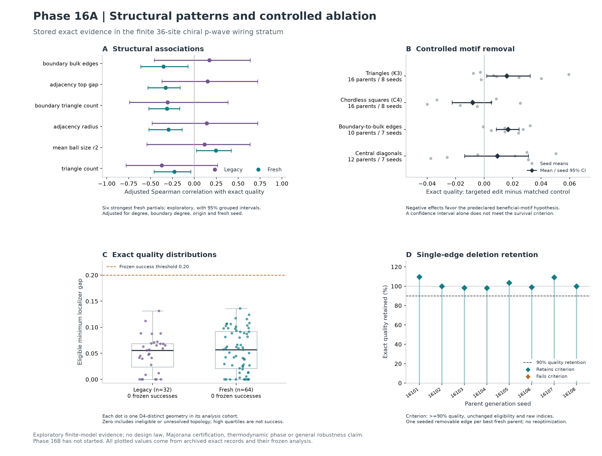

# Phase-16A Pattern/Ablation Report - Internal Mechanism Checkpoint

**Block F complete (tasks 16.1-16.12); Internal Mechanism Checkpoint PASS with
exploratory and null findings. No motif meets the predeclared survival criterion.
MECHANISM_GATE has not been evaluated. Phase 16B has not started.**

The reproducible observation is that several structural descriptors predict
differences in this finite model. The experiments do not establish a causal
design rule. In particular, the apparent benefit of more chordless squares
largely disappears after adjustment, and no controlled motif effect passes
Holm correction. Lower triangle and boundary-to-bulk counts remain provisional
questions. Eight single-edge simplifications retain the specified finite
quality criterion. None of the analyzed or intervened candidates reaches the
unchanged success threshold of **0.20**.

## 1. Dataset and campaigns

The [frozen v2 protocol](phase_16a_protocol.md) uses the existing chiral p-wave
model, t=Delta=1, mu=2, chirality +1, component-major Nambu basis, center (2.5,2.5),
kappa=(0.1,0.2,0.3), tolerance 1e-10. Clean quality is the minimum localizer gap
gated by agreeing nonzero indices and PHS. Graphs have 36 sites on the 6x6 unit
grid, 60 edges, fixed 20-site perimeter, degrees 2-6, connectivity, no straight
edge crossings and edge lengths at most sqrt(2). Only the explicitly identified
single-edge simplifications use 59 edges.

| Cohort | Exact records imported / independent geometry rows | Eligible | Trivial / unresolved | Mean quality | Maximum quality | Successes |
|---|---:|---:|---:|---:|---:|---:|
| Phase-15 four control arms | 48 / 32 | 26 | 3 / 3 | 0.049613948 | 0.131304059 | 0 |
| New Phase-16A sample | 64 / 64 | 54 | 7 / 3 | 0.055514071 | 0.136028875 | 0 |

All legacy origins are retained while D4-equivalent embedded graphs are pooled.
The three Phase-15 repeat/recovery campaigns are not additional observations.
Legacy and fresh associations are analyzed separately. Fresh seeds 16101-16108
each contribute eight geometries; odd seeds use Random, even seeds Patch.
The entire fresh sample is selected without physics labels. Of 176 raw
proposals, 98 are invalid and 14 violate the stricter analysis exclusion radius;
64 are accepted. Their minimum symmetry-minimized edge-Jaccard distance to
another analysis geometry is **0.153846154**, greater than 0.15.

| Seed | Generator | Eligible / 8 | Mean quality | Best quality |
|---|---|---:|---:|---:|
| 16101 | Random | 8 | 0.053994659 | 0.103379946 |
| 16102 | Patch | 8 | 0.070529696 | 0.123925169 |
| 16103 | Random | 5 | 0.035235753 | 0.093162355 |
| 16104 | Patch | 8 | 0.078592061 | 0.107969201 |
| 16105 | Random | 6 | 0.054915415 | 0.117267240 |
| 16106 | Patch | 6 | 0.051885911 | 0.136028875 |
| 16107 | Random | 5 | 0.023354065 | 0.062034257 |
| 16108 | Patch | 8 | 0.075605010 | 0.106633818 |

These cohorts are not a new generator-superiority benchmark. Their different
selection histories and the seed/generator allocation prevent such a claim.
All eight seeds and their derived candidates are consumed by Phase 16A and
must be excluded from independent Phase-16B validation.

## 2. Extracted feature families

There are **57 scalar descriptors**, plus full graph spectra, degree sequences,
explicit motif instances and finite ball-growth vectors. Each cohort has 34
variable scalar features; 23 constants are excluded from testing. Seven variable
features become unidentifiable under adjustment and retain null estimates;
they still occupy their slots in the 34-hypothesis correction family.

| Family | Definition and scope |
|---|---|
| Size/connectivity | Sites, edges, components, largest component, connected status, cycle rank m-n+c. Cycle rank is not a geometric hole count. |
| Degree | Mean, population variance, minimum/maximum, fractions at degrees 0-6 and above 6; site-indexed degree sequence retained. |
| Clustering/motifs | Mean local clustering (zero for degree below two), induced K3 triples, induced chordless C4 vertex sets, triangles touching the boundary. |
| Paths | Mean, maximum and population SD over reachable unordered pairs; reachable fraction; global efficiency with disconnected pairs contributing zero; mean nearest-boundary distance from bulk sites. |
| Boundary/bulk | Boundary fraction and size ratio, mean degree in each subset, number of edges crossing between the two subsets. |
| Graph spectra | Full adjacency, combinatorial and normalized Laplacian spectra; adjacency radius, largest algebraic eigenvalue gap, mean absolute eigenvalue; Laplacian radius and second eigenvalue, normalized second eigenvalue. These are not BdG spectra. |
| Coordinates | Endpoint edge-length statistics, mean pair distance, bounding-box density, covariance anisotropy, bond-direction second-moment anisotropy and mean cosine of incident bond angles. Explicit hole labels are counted without inferring holes from cycles. |
| Finite growth | Mean closed graph-ball cardinalities at radii 1-4, including the center. Effective/fractal dimension is explicitly unavailable: one size provides neither a justified fit range nor a scaling family. |

All coordinate-only size descriptors are constant in this experiment. Full
definitions and missing-value behavior live in `patterns/features.py`; tests
include every five-vertex simple graph for induced K3/C4 counts, all eight D4
transformations, relabeling, disconnected and edgeless graphs and known spectra.

## 3. Strongest correlations and confound adjustment

Partial Spearman analysis residualizes ranks against degree fractions 2-6,
boundary mean degree and origin membership, plus fresh seed indicators.
There are 1,999 restricted residual permutations with a +1 correction and
nuisance reprojection. Bootstrap intervals refit ranks and adjustment: 1,000
family draws for legacy data and seed draws for fresh data. The intervals are
pointwise exploratory intervals, not simultaneous confidence guarantees.

| Feature | Legacy raw / partial rho | Fresh raw / partial rho | Fresh 95% interval | Fresh BH q |
|---|---:|---:|---|---:|
| Boundary-to-bulk edges | -0.318 / +0.170 | -0.395 / -0.353 | [-0.611, -0.072] | 0.221 |
| Adjacency top eigenvalue gap | +0.088 / +0.152 | -0.257 / -0.328 | [-0.530, -0.164] | 0.302 |
| Boundary-touching triangles | -0.525 / -0.305 | -0.581 / -0.312 | [-0.520, -0.167] | 0.302 |
| Adjacency spectral radius | -0.202 / +0.140 | -0.519 / -0.296 | [-0.519, -0.140] | 0.302 |
| Mean radius-2 ball size | +0.047 / +0.117 | +0.074 / +0.246 | [+0.024, +0.421] | 0.507 |
| All triangles | -0.625 / -0.372 | -0.616 / -0.228 | [-0.460, -0.041] | 0.652 |
| Chordless squares | +0.513 / +0.092 | +0.505 / -0.007 | [-0.273, +0.369] | 1.000 |
| Central diagonals | -0.547 / -0.493 | -0.492 / -0.116 | [-0.359, +0.116] | 0.947 |

**No association survives BH or BY at 0.05 in either cohort.** Minimum fresh
BY q is 0.910; all legacy BY q values are 1. The six strongest fresh partials
retain their signs in all eight leave-one-seed-out fits. This sign stability
does not provide eight independent significance tests. The strongest legacy
partial, central-diagonal count, weakens substantially in the fresh cohort.
Several spectral and cut descriptors reverse their adjusted direction across
cohorts; boundary-touching triangles are more directionally consistent.

Rank-linear adjustment is approximate. For example, rank(degree variance) need
not be a linear combination of ranked degree fractions even though the raw
variance is determined by the degree histogram. Residual associations are not
proof that all effects of the histogram have been removed. The interventions
below preserve each individual vertex degree exactly and provide a different,
more controlled check.

## 4. Feature-importance stability

Fixed ridge regression (alpha=10) and five-neighbor regression use
training-only standardization, eight leave-one-seed-out splits, and purging of
train/test pairs at distance <=0.15. Each fold has 56 training and eight test
geometries. Three fixed test-column permutations measure the increase in MSE.
No intervention labels enter these models. Raw predictions and fold errors
are stored, including negative importances.

| Model | Held-out MSE | Training-mean baseline MSE | Folds beating baseline | Largest average permutation contributions |
|---|---:|---:|---:|---|
| Ridge | 0.001008173 | 0.001703772 | 8/8 | Boundary-to-bulk edges, boundary triangles, adjacency top gap |
| 5-neighbor | 0.001079537 | 0.001703772 | 7/8 | Degree-5 fraction, degree-2 fraction, adjacency top gap |

Prediction improves on this simple baseline, but **importance ranking is
unstable**: the cross-model rank correlation is only **0.208**. Ridge's top
average feature, boundary-to-bulk edges, has positive importance in only 5/8
folds and rank SD 14.26. Ridge clustering importance is positive in 8/8 folds
but appears in the top five only 2/8 times. The neighbor model instead places
more weight on degree fractions. Overlapping training folds and correlated
features limit the interpretation of the descriptive seed-bootstrap intervals.
No physical mechanism is inferred from importance alone.

## 5. Precisely defined motifs and recurring patterns

The four intervention targets were declared before any new physics outcomes:

1. `triangle_count`: unordered three-site sets inducing all three K3 edges.
2. `chordless_square_count`: unordered four-site sets inducing a connected
   degree-two C4, with neither chord present.
3. `boundary_bulk_edges`: edges with exactly one endpoint on the fixed
   20-site perimeter; this is a graph-cut descriptor, not a graphlet.
4. `central_diagonal_count`: sqrt(2)-length edges whose midpoint has distance
   <=1.5 from (2.5,2.5), with the radius boundary included.

Triangle depletion and square enrichment recur in the raw higher-quality
cohorts. Their adjusted behavior differs: the square signal nearly vanishes.
Boundary-touching triangle depletion is directionally more consistent than
several graph-spectral associations. Motif instances, counts, site labels and
every actual edge replacement are retained for reproduction. No learned
representation or post-hoc motif mining threshold was introduced.

## 6. Successful versus unsuccessful comparisons

The requested frozen-success comparison is **unavailable**, because both
cohorts and all intervention/simplification candidates have zero successes.
There is no replacement success definition.

A separate exploratory comparison uses the legacy upper-quartile cutoff
**0.068432472**, carried unchanged to fresh data. It creates 8 higher versus
24 lower legacy rows and 24 higher versus 40 lower fresh rows. Minimum-total-
covariate-distance matching without replacement yields 8 and 24 pairs.
Fresh higher-quality members average 2.625 fewer triangles, 2.875 more chordless
squares, 1.708 fewer boundary-to-bulk edges and 1.542 fewer central diagonals
than their matched partners. Legacy matched differences are much smaller
(-0.125, -0.125, -0.375, -0.875 respectively).

Matching is imperfect: fresh pairs share the seed in 18/24 cases and generator
in 20/24; maximum standardized control RMS distance is 1.481. Legacy origin
membership agrees in 7/8 pairs. These are descriptive comparisons with explicit
balance diagnostics, not randomized causal estimates.

## 7. Geometry clusters and families

Single-link families use the complete D4-minimized edge-Jaccard matrix.
At radii 0.10/0.15/0.20, the legacy cohort has **25/25/19** families; the fresh
cohort has **64/64/61**. The largest legacy family grows from four to eight
members, with maximum internal distance 0.261 at radius 0.20, demonstrating
single-link chaining. Fresh radius-0.20 families have at most two members.
These families express a declared distance relation, not a physical universality class.

Ward clustering of standardized variable features is descriptive and uses no
physics labels. At k=2, the fresh 18-member cluster has mean quality 0.084846430,
7.56 triangles, 12.72 squares and 1.33 central diagonals; the 46-member cluster
has 0.044036192, 13.24 triangles, 6.07 squares and 5.15 central diagonals.
All 18 members of the first cluster are Patch-generated: generator confounding
is substantial. That cluster persists at k=3 and k=4, while the other cluster
splits into 17/29 and then 17/11/18 members. Legacy clustering similarly retains
a ten-member sparse-triangle cluster with mean quality 0.075752912.

These patterns recur structurally, but neither cluster labels nor cluster mean
scores establish a mechanism. Cluster membership at all three k values and
all three distance radii is archived.

## 8. Outliers and exact candidates

Outliers are ranked by RMS standardized distance from the legacy feature center;
quality is displayed separately. The strongest structural outlier,
`fresh-16107-01` (distance 1.476), has **zero eligible quality**. The next two,
`fresh-16102-07` and `fresh-16105-03`, have qualities 0.003116370 and 0.040832878.
Novelty therefore does not identify a physics winner.

Among members above the separate exploratory cutoff, `fresh-16102-03` and
`fresh-16102-06` are the largest outliers, with quality 0.101164799/0.123925169
and feature distances 0.959/0.947. They are useful candidate contrasts, not
certified anomalous materials.

Best fresh candidate: `fresh-16106-03`, quality **0.136028875**, indices
**[1,1,1]**, minimum |E| **0.058199077**, mean low-state boundary weight
**0.724634500**, geometry
`geometry-archive-v1-sha256:20f83cd04625bd0becb2dd1931a31152e5a35cd8f63b60c54e0a0ecb1d985711`.
Its complete record/eigensystem is `results/phase16a/exact/fresh-16106-03.json`.
The largest quality anywhere in the controlled experiments is 0.161872706 in
a control edit. It is not an optimized discovery or a threshold success.
Every such candidate has an independent exact confirmation.

## 9. Geometry simplification

For the best fresh parent per seed, one valid non-perimeter edge is selected
by a fixed seed and deleted, with no optimization. All eight 59-edge graphs
remain connected, planar, within degree/length bounds, and keep indices [1,1,1].

| Seed | Removed edge (zero-based grid labels) | Before quality | After quality | Retained |
|---|---|---:|---:|---:|
| 16101 | (1,8) | 0.103379946 | 0.113285052 | 109.58% |
| 16102 | (28,29) | 0.123925169 | 0.123716329 | 99.83% |
| 16103 | (22,28) | 0.093162355 | 0.091651493 | 98.38% |
| 16104 | (19,25) | 0.107969201 | 0.105904081 | 98.09% |
| 16105 | (16,22) | 0.117267240 | 0.121454832 | 103.57% |
| 16106 | (16,22) | 0.136028875 | 0.134847452 | 99.13% |
| 16107 | (2,9) | 0.062034257 | 0.067718883 | 109.16% |
| 16108 | (13,19) | 0.106633818 | 0.106591445 | 99.96% |

Thus **8/8 retain >=90% quality, eligibility and raw indices**. This is limited
evidence of tolerance to these particular edge deletions. It does not identify
a minimal geometry, prove that arbitrary edges are unnecessary, or establish
robustness to repeated deletion. Node removal and size scaling are unavailable
under the fixed-coordinate family and were not substituted with unrelated graphs.
Mean quality retention is 102.213%, with a descriptive seed-bootstrap 95%
interval [99.412%, 105.454%] (4,000 draws, seed 16603); a mean improvement
is not established. This does not estimate retention for arbitrary deleted edges.

## 10. Controlled ablation design

For each motif and seed, candidates are considered in descending parent quality
until two admit matched interventions, or the eight candidates are exhausted.
Consequently some feasible parents are low-quality or ineligible; availability
is outcome-dependent through parent ordering and is fully recorded.

Each edit replaces two disjoint edges by two absent edges, preserving **every
vertex degree**, total edge count, perimeter, coordinates and validity. Targets
reduce the motif count; controls preserve it. Target and control have equal
changes in total diagonal count and boundary-to-bulk count except when the
latter is the target. Remaining motif differences are minimized after scaling
by SD across that parent's valid structural edits. Explicit perturbation seeds
break ties. Two distinct pairs are used only where available. There is no
physics-based edit selection and no optimization after the edit.

All 79 pairs, comprising 158 exact edited instances, receive two full exact
calculations each. Some edits recur across motif tests: these 158 instances
represent **137 D4-distinct geometries**, not 158 independent materials.
Perturbation replicates are averaged within parent, then parents within seed;
seeds receive equal weight. Parent-bootstrap estimates are also stored.

Triangle tests use 16 parents/8 seeds; squares 16/8; cut edges 10/7; central
diagonals 12/7. Seed 16101 has no matched cut-edge ablation, and seed 16108 no
matched central-diagonal ablation. Constraints are never relaxed to fill quotas.
Cut-edge removal necessarily changes the cut by two under degree preservation;
triangle removal changes counts by 1-2, square removal by 1-3 and central
diagonal removal by one.

## 11. Effect sizes and uncertainty

Primary effect = exact quality(target) - exact quality(control). A negative
value favors the predeclared hypothesis that the motif is beneficial.
Confidence intervals use 4,000 seed-bootstrap draws. Exact two-sided
seed-sign-flip tests assume symmetric exchangeable seed effects under the null;
Holm adjusts the four targets. These are small-sample conditional tests, not
proof of isolated motif causality.

| Target reduced | Pairs | Target - parent | Control - parent | Target - control [95% CI] | Negative seeds | Raw p / Holm p |
|---|---:|---:|---:|---|---:|---:|
| Triangles | 27 | -0.008472 | -0.024327 | +0.015855 [+0.001745, +0.032244] | 3/8 | 0.1172 / 0.3516 |
| Chordless squares | 25 | -0.032014 | -0.023927 | -0.008088 [-0.022433, +0.005148] | 5/8 | 0.3047 / 0.6094 |
| Boundary-to-bulk edges | 13 | -0.004866 | -0.021584 | +0.016718 [+0.008483, +0.024431] | 1/7 | 0.0313 / 0.1250 |
| Central diagonals | 14 | -0.008826 | -0.018095 | +0.009269 [-0.013704, +0.030967] | 3/7 | 0.4844 / 0.6094 |

The positive triangle/cut effects mean targeted changes were less harmful than
their controls on average; they do not mean that removing those motifs
systematically improves the parent. Pointwise bootstrap intervals can exclude
zero even when the coarse sign-flip/multiplicity test fails. Both results are
reported rather than selecting the more favorable inference.

| Target | Ungated localizer gap difference | Minimum \|E\| difference | Boundary-weight difference |
|---|---:|---:|---:|
| Triangles | +0.014714 | -0.000343 | +0.004363 |
| Chordless squares | -0.007281 | +0.014273 | -0.021746 |
| Boundary-to-bulk edges | +0.016090 | +0.013946 | +0.028724 |
| Central diagonals | +0.010953 | -0.010020 | +0.016857 |

Every minimum-|E| and boundary-weight effect interval includes zero; complete
intervals and seed means are in the machine-readable report. Triangle targets
retain eligible topology in all 27 comparisons, while five controls become
unresolved. Square targets include one eligible-to-trivial transition; all 25
controls remain eligible. Central-diagonal targets include three
eligible-to-unresolved transitions; their controls include one loss to trivial,
one to unresolved and one unresolved-to-eligible transition. These changes
remain raw finite-localizer diagnostics, not Majorana or thermodynamic claims.

## 12. Patterns that survived

**No motif survives the predeclared criterion:** seed CI in the beneficial
direction, at least seven negative seed means, and Holm p<=0.05. No opposite-
direction effect passes the corresponding stringent check either.

The independently confirmed facts that survive measurement checks are narrower:
the 96 distinct analysis geometries and their feature values, the stored
predictive errors, all controlled finite-model differences, and the eight
specific successful simplifications. They justify further questions without
promoting a design rule or passing the later MECHANISM_GATE.

## 13. Patterns that failed or remain inconclusive

- **More squares imply better physics:** strong raw enrichment collapses to
  adjusted rho -0.007 in fresh data; the controlled CI crosses zero. Reject
  promotion of a general square-count benefit.
- **More triangles or cut edges are beneficial:** controlled average effects
  point against that predeclared direction. Reject promotion; the converse
  hypothesis remains unconfirmed after multiplicity correction.
- **Central-diagonal abundance is a reproducible mechanism:** the large legacy
  partial weakens in fresh data and the ablation interval crosses zero.
  Reject promotion of the location/count claim on this evidence.
- **One feature-importance ranking identifies the mechanism:** models disagree
  and fold ranks vary widely. Reject a causal interpretation of importance.

Failure to promote is not proof that an effect is zero. Sparse matched-edit
availability and seven/eight-seed inference leave considerable uncertainty.

## 14. Confounders, scope and reproducibility

Size, edge count, coordinates and boundary size are fixed. Interventions remove
degree-distribution confounding exactly, but change edge placement, pairing
directions and other graph motifs together. For triangle ablations, target-
control square-count differences range 0 to +3; square ablations change triangle
counts by -1 to +2. Cut-edge edits change other motif counts too. These are
controlled compound rewiring effects, not pure independent motif manipulations.
The two arms can also remove edges in different spatial locations.

Parent selection favors high quality subject to edit availability. Matching
controls, reporting both changes from parent and averaging within parent reduce
some selection artifacts; they do not remove all regression-to-mean effects.
The global fresh exclusion filter also conditions the sampling distribution.
Only four seeds per generator, related legacy geometries, correlated feature
families and seed/generator nesting restrict generalization.

There is no new disorder ensemble, cross-model validation, size sequence,
effective-dimension estimate, separated Majorana demonstration or thermodynamic
claim. Phase-15 four-sample disorder evidence stays archived as legacy evidence;
it is not extrapolated to the edited geometries. All new low-energy data are
`diagnostics_only`, `majorana_claim=false`.

The v1 draft specified six seeds but a seven-of-eight survival condition.
Before any new exact outcome, v2 corrected the allocation to eight seeds while
retaining the 700-attempt cap. Scientific definitions and tolerances did not
change. Implementation reviews also repaired serialization and recovery errors
before the non-test campaign. No outcome-driven protocol amendment was made.

**Cost:** 128 fresh clean/confirmation evaluations + 316 intervention
evaluations + 16 simplification evaluations + 2 regular-grid references +
2 independent reproduction evaluations = **464**, with zero failed or
interrupted attempts. Each evaluation contains one 72-dimensional BdG
eigensystem and three 144-dimensional localizers. Recorded exact-stage time is
46.973 s; this excludes generation, matching, storage and analysis and is not a
hardware benchmark. The full suite ran concurrently for part of the campaign.
Remaining budget is not an instruction to run more experiments.

The arithmetic audit checks **946 inventory files, 464 stored exact records,
231 confirmation pairs and all seven Phase-15 source archives**. It rebuilds
Majorana diagnostics from stored eigenvectors with eigensolvers disabled.
Maximum BdG eigen-equation residual is 6.72e-15 and orthogonality residual
2.89e-15. Localizer results are checked for stored consistency and exact
confirmation equality; the audit does not rerun their eigensolvers.
There are **241 D4-distinct study geometries** including legacy, fresh, edited
and simplified structures (242 including the regular-grid reference).

Validation: **93 subsystem/reference tests passed**; full repository suite
**2842 passed in 760.01 s**, 2026-09-14. Ruff passes. Isolated Mypy passes on
the seven new source files with `--python-version 3.14 --follow-imports silent
--ignore-missing-imports`; missing SciPy stubs and the repository's pre-existing
default Python-3.11/installed-NumPy-stub incompatibility remain explicit limits.
The independent fresh reference matches exactly. Stored-only analysis
regeneration reproduces the frozen analysis with zero additional exact calls.
An ordinary complete CLI resume also reproduces every frozen artifact and
leaves the attempt count at 464; no fresh numerical stage is executed.

Base commit: `75eef61b2c24063f4f4b185116eb3bfde188c043`, plus preserved dirty
Phase-15 additions and new Phase-16A source.

| Provenance | SHA-256 |
|---|---|
| Frozen source | `ee9b56d098e490b6434c6e80e9885da7dec0f31ee55721083f23794b34d0ea71` |
| Protocol v2 | `813e6269b174d2bc4bf28a2b331f66a7c74ddb603dbd52f82b796a585c465671` |
| Campaign implementation | `e288751d3431c731ff0d6a83318ef2c0e4affab3427a9324f9bd5253e997cdf5` |
| Source archive | `45cd50d8308f735f8a7594677dcaf245196948f09fc9dbc2bf87bbf1aebd7b79` |
| Inventory file | `7db5fe1a6e7c6f7188100e13c709ff24c5565b63db9e0507f63281c8bd8cae81` |

## 15. Ranked provisional hypotheses for Phase 16B

These are priorities for independent falsification, **not promoted mechanisms**.
New geometries must exclude all Phase-16A parents, edits, simplifications and
their symmetry/near-duplicate families. The frozen success criterion stays 0.20.

| Rank | Candidate hypothesis and evidence | Independent test needed before promotion |
|---|---|---|
| 1 | Lower boundary-to-bulk coupling count may reduce damage from constrained rewiring. Fresh adjusted rho -0.353; target-control +0.016718, but legacy adjusted sign reverses and Holm p=0.125. | On unseen degree-matched parents, predeclare both cut-reduction and reciprocal cut-addition interventions; match triangle/square counts and spatial edit locations more closely. Reject if the directional effect fails a predeclared multiplicity-aware test. |
| 2 | Boundary-local triangle placement may matter more than total triangle count. Boundary-triangle partials agree across cohorts; total triangle ablations are less harmful than controls but Holm p=0.352. | Contrast removing boundary-touching versus bulk-only K3 instances while matching total triangle change, cut size, diagonal count and squares. Require reproducibility across independent seeds and matched families. |
| 3 | Some higher-quality finite geometries tolerate a single non-perimeter deletion. All eight tested parents retain >=90% quality and [1,1,1]. | Freeze a deletion protocol on unseen parents spanning the quality distribution, multiple predetermined edges per parent and equal parent weighting. Reject the general tolerance claim if retention is uncommon or topology frequently changes. |
| 4 | Raw chordless-square enrichment is primarily a proxy for degree/placement structure, rather than a direct quality benefit. Adjusted fresh rho is near zero and ablation CI crosses zero. | Design stricter paired C4 creation/destruction with fixed degree sequence and matched cut/triangle/central-diagonal changes; predeclare an equivalence margin if testing practical absence rather than failing to reject zero. |
| 5 | Central diagonal location alone may not explain the legacy association. Partial rho shrinks from -0.493 to -0.116 and the location ablation is inconclusive. | Use unseen parents with matched central/peripheral diagonal relocations and equal other motif changes; test location effects rather than pooling central count with total diagonal abundance. |

Artifacts: [machine-readable report](phase_16a_pattern_ablation.json),
[protocol](phase_16a_protocol.md), [figure](phase_16a_patterns.png).
Raw inputs, features, motif instances, all selection plans, exact records and
full eigensystems, confirmations, analysis, source ZIP and inventory are in
`results/phase16a/`; the audit is `results/phase16a-audit.json`.
The `results/` tree is git-ignored and must be preserved separately when moving
the repository. Reproduction commands are in [Phase-16A usage](../phase_16a_usage_de.md).

**Stop at the Internal Mechanism Checkpoint. Do not start Phase 16B automatically.**

