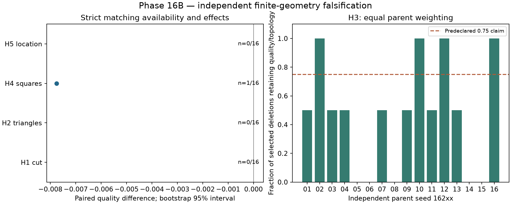

# Phase 16B — independent falsification report

**Gate 16: NOT_ESTABLISHED.** The bounded validation experiment is
complete; a reproducible geometric mechanism is not established. The frozen
16A evidence remains exploratory/null. Cross-model generality remains unavailable.
No thermodynamic phase or separated-Majorana claim is made.

## Frozen question and design

The five questions are taken from section 15 of the
[frozen 16A report](phase_16a_pattern_ablation.md). See the
[predeclared 16B protocol](phase_16b_protocol.md) for signs, matching constraints,
statistical assumptions and the 700-attempt cap. No outcomes selected the parents
or edits. Success still means **Q >= 0.20**.

The exclusion snapshot contains **32912 D4-distinct edge sets**
from **1174 source files**, including 16A parents,
edits and simplifications and existing discovery proposal pools. Even rejected
proposal structures were excluded conservatively. Every selected new structure
is more than 0.15 D4 edge-Jaccard distance from this snapshot and every earlier
independent seed family. Related arms within a parent are deliberately paired.
Later production-campaign growth does not modify the recorded cutoff.

There are 16 unseen parents, eight Random and eight Patch, seeds 16201–16216.
The first valid separated proposal per seed was used; **95**
raw proposals were considered. No successful-candidate set was redefined.
Strict matching failures remain missing tests, not zero effects.

## Independent results

| Hypothesis | Parents | Mean | Bootstrap 95% interval | Holm p (five tests) | Result |
|---|---:|---:|---|---:|---|
| H1: Cut decrease vs increase | 0 | unavailable | unavailable | 1 | insufficient_matched_parents; support=False |
| H2: Boundary vs bulk triangles | 0 | unavailable | unavailable | 1 | insufficient_matched_parents; support=False |
| H3: Single-edge deletion retention | 16 | 0.468750 | 0.281250, 0.656250 | 0.0949097 | tested; support=False |
| H4: Square creation vs destruction | 1 | -0.007757 | unavailable | 1 | insufficient_matched_parents; support=False |
| H5: Central vs peripheral diagonals | 0 | unavailable | unavailable | 1 | insufficient_matched_parents; support=False |

H1 reports Q(cut decrease)-Q(cut increase). H2 reports Q(bulk triangle removal)-
Q(boundary triangle removal). H4 reports Q(square creation)-Q(destruction).
H5 reports Q(central increase)-Q(decrease). H3 reports retention fraction and tests
its difference from 0.75. At least eight independent parents are needed for a
test; unavailable tests retain p=1 in the five-test correction family.
Bootstrap intervals are descriptive and not simultaneous confidence intervals.
Sign-flip validity assumes independent symmetric parent errors, not randomized
treatment assignment. Spatial matching minimizes a cost, not every spatial feature.

Supported predeclared hypotheses: **none**.
Failure to detect an effect does not establish equivalence or the proposed proxy
explanation. The available paired values, parameter sensitivities, all motif
deltas and residual spatial costs are retained in the JSON and frozen plan.
H1/H2/H4/H5 lack sufficient matched parents: their explanations are untested,
not falsified. H3's corrected p=0.094910 does not reject the
predeclared 0.75 value at family-wise alpha=0.05; the lower observed retention
also does not support the claim that mean retention exceeds 0.75.

Main-model stages contain **0/50
success roles**; best main-model quality **0.095223378**.
Roles can repeat a geometry across hypotheses; these are not counts of independent
discoveries. Statistical sample sizes are independent seed/parent counts.

## Deletion tolerance and parent coverage

Mean parent-weighted retention is **0.4688**. There are
**17 failed deletion retentions** and **3 changed index
triplets**. Every deletion is tested separately from its original 60-edge parent;
the two edges are never deleted sequentially. Positive Q and preserved eligible
nonzero indices are required. Zero-quality parents cannot count as retention.
This bounded outcome-blind sample spans its observed quality distribution; it
does not ensure representation of unavailable high-quality successes.

| Seed | Generator | Parent Q | Available paired questions | Retained deletions |
|---|---|---:|---|---:|
| 16201 | random | 0.092323940 | none | 1/2 |
| 16202 | patch | 0.061889829 | none | 2/2 |
| 16203 | random | 0.000294472 | none | 1/2 |
| 16204 | patch | 0.068782210 | h4 | 1/2 |
| 16205 | random | 0.000000000 | none | 0/2 |
| 16206 | patch | 0.000000000 | none | 0/2 |
| 16207 | random | 0.044653876 | none | 1/2 |
| 16208 | patch | 0.000000000 | none | 0/2 |
| 16209 | random | 0.069177669 | none | 1/2 |
| 16210 | patch | 0.080385262 | none | 2/2 |
| 16211 | random | 0.016625224 | none | 1/2 |
| 16212 | patch | 0.085048288 | none | 2/2 |
| 16213 | random | 0.044389281 | none | 1/2 |
| 16214 | patch | 0.055596420 | none | 0/2 |
| 16215 | random | 0.000000000 | none | 0/2 |
| 16216 | patch | 0.063371422 | none | 2/2 |

## Cross-model assessment (16.15)

All 60-edge roles were evaluated at mu=1.9, 2.0 and 2.1 in the existing chiral
p-wave adapter. This is parameter sensitivity within one model. It is not an
independent model-family comparison. QWZ/BHZ adapters build their own square
lattices and do not define couplings on these diagonal wiring graphs. No new
coupling convention was invented. Thus cross-model universality is **unavailable**,
and task 16.15 is an explicit limitation of the completed bounded study.
Size scaling and new disorder validation are also unavailable in this protocol.

## Numerical verification and provenance

The journal contains **140/700 completed charged attempts** and
**52 independently seeded exact confirmation pairs**.
No failed/interrupted stage is present. Known regular-grid references reproduce
index triplets [1,1,1] at mu=2 and [0,0,0] at mu=8. Every stored eigensystem passes
Hamiltonian residual and orthonormality checks at 1e-10; records, diagnostics,
confirmations, strict matches, family separation and checksums pass the audit.
This verifies finite numerical evidence, not a thermodynamic phase.

| Provenance | SHA-256 / value |
|---|---|
| Base commit (dirty source archived) | `d3180d9fa1c538fd8a084ba3c80a5099a0c23c16` |
| Source | `d96499c9a8afa2ac020d51bb5345b925857a6ee05e02dbed3d12e91734495b92` |
| Protocol | `29212daa1b1c13407586d79eef3f90e6eb6125ebe36a84f65ab0ea37c7d3f431` |
| Experiment driver | `0912d888085f7c6c826e11c469e373f3e72e986536e64faaa0220aed0a78687e` |
| Exclusion snapshot | `b3f33d80a9952a0a6b2f0113187ec55f1a4b696c87b4a5ffcaf76bce0502e58f` |
| Frozen plan | `9f34c67e9b06eca552263de51e4cbfcb7f94048259506ed28177d5cc44ae1986` |
| Source archive | `d9759cb28d64b8fdd85588ca3378ea7bc4ed8783d5005fe06dae4ababa67d393` |
| Complete inventory | `fcff5ba409788d22b560755dc99f95ea57cda080336ec8219336e07b2ec608f2` |

Runtime: Python 3.14.7, NumPy 2.5.3,
SciPy 1.18.1; four numerical thread limits=1.
The commit alone is insufficient: use the archived dirty source and frozen files.
**Full repository regression: 2973 passed in 675.95s (0:11:15).** Complete driver replay retains
the same 140 charged attempts and inventory, adding zero numerical calls.
Ruff and isolated strict Mypy (Python 3.14) pass for the new runtime and drivers.
Full regression and replay logs are recorded in
[execution state](../roadmap/EXECUTION_STATE.md) and `results/phase16b-*.log`.

Raw plans, exclusions, exact records, eigensystems, source ZIP and inventory:
`results/phase16b/` (git-ignored; preserve separately). Reproduction commands:
[German usage guide](../phase_16b_usage_de.md). This report is generated from stored
records by `scripts/phase_16b_report.py`; no numerical evaluations are added.

## Gate decision and boundary

The independent falsification workflow is complete with the limitations above.
**MECHANISM_GATE is not established; no mechanism or model-independent design rule
is promoted.** Null findings and unavailable strict matches remain valid outputs.
Block G ends here. Phase 17 and large searches are not started by this workflow.

